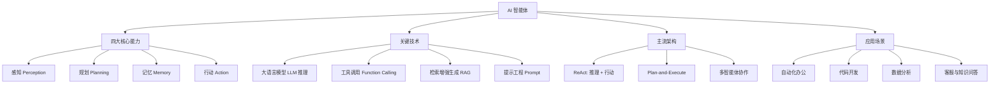

智能体（AI Agent）是能**自主感知环境、做出决策并采取行动**以完成目标的 AI 系统。它与「一问一答」的聊天机器人最大的区别在于：智能体拥有**规划、记忆与工具调用**能力，能拆解复杂任务并一步步执行。

> [!info] 一句话定位
> 智能体 = 大脑（大模型）+ 手脚（工具）+ 记忆（上下文）+ 规划（任务拆解），能自己把事办完。

## 知识体系

## 核心要点

- **与大模型的区别**：大模型是「会说话的知识库」，智能体是「会做事的执行者」。
- **规划（Planning）**：把复杂目标拆成可执行的子任务，并根据执行结果动态调整。
- **记忆（Memory）**：短期记忆是当前对话上下文，长期记忆靠外部存储（向量数据库）实现。
- **工具调用（Tool Use / Function Calling）**：让模型能查网页、跑代码、读写文件、调 API，从而突破「只会文本」的限制。
- **RAG（检索增强生成）**：先检索相关知识，再让模型基于检索结果回答，缓解幻觉、接入私有知识。
- **主流范式**：
  - **ReAct**：交替「推理（Reason）」与「行动（Act）」，边想边做。
  - **Plan-and-Execute**：先整体规划，再逐步执行。
  - **多智能体**：多个角色分工协作（如「产品经理 + 开发 + 测试」）。
- **可靠性与成本**：智能体要面对幻觉、死循环、工具报错等问题，需要护栏（Guardrails）、重试与人工确认机制。

## 学习建议

- 先理解 [[人工智能]] 的基础，再动手用框架（如 LangChain、AutoGPT 类思路）搭一个能调工具的 Agent；
- 从「单一工具 + 简单任务」开始，逐步增加记忆与多步规划；
- 关注成本与延迟，工程化落地比 Demo 难得多。

## 相关

- [[人工智能]]
- [[AI]]
- [[数学]]
