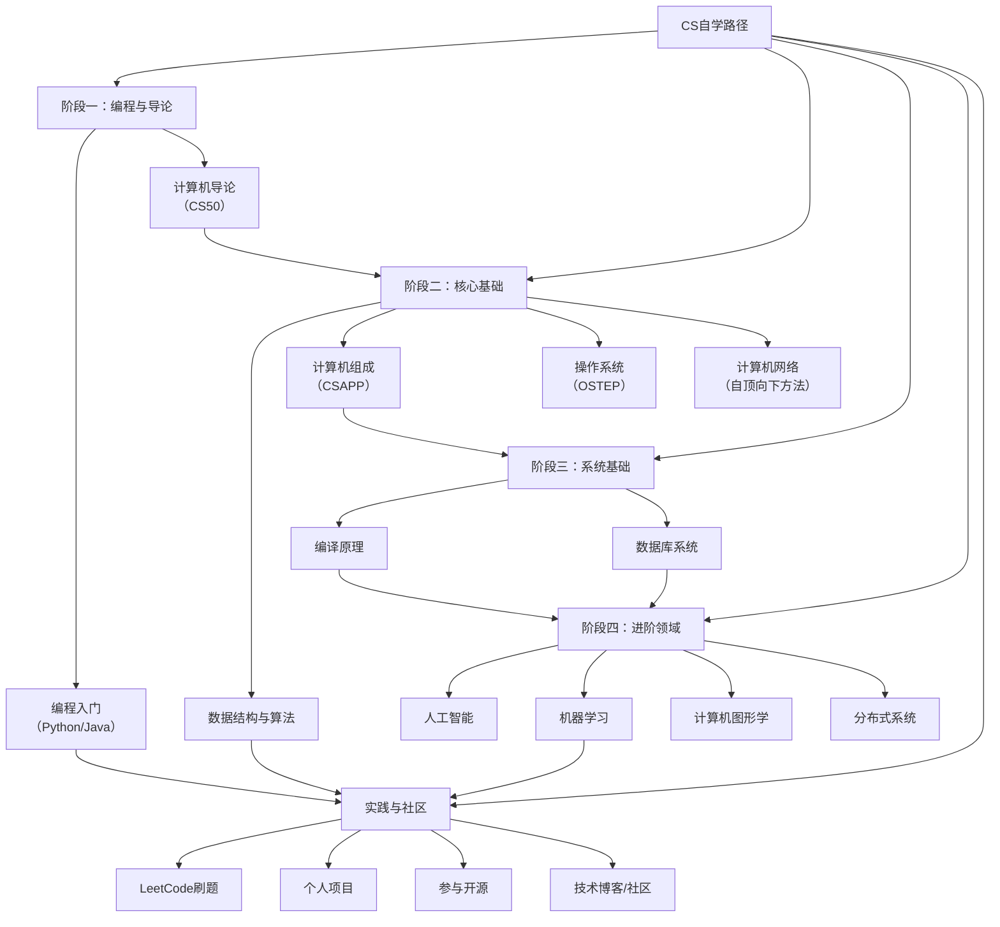

---
> [!hint] CS
> 来源：https://csdiy.wiki/
>
> 这份指南旨在模拟一个完整的大学计算机科学本科课程体系，并全部由可供自学的优质在线资源组成。它遵循“先广后深”的原则，帮你建立扎实的计算机科学知识体系:
>
> - [[必学工具]]
> - 好书推荐
> - 数学基础
> - 数学进阶
> - 编程入门
> - [[电子基础]]
> - [[数据结构与算法]]
> - 软件工程
> - 计算机系统基础
> - 体系结构
> - 操作系统
> - 并行与分布式系统
> - 计算机系统安全
> - 计算机网络
> - 数据库系统
> - 编译原理
> - 编程语言设计与分析
> - 计算机图形学
> - Web开发
> - 数据科学
> - 人工智能
> - 机器学习
> - 机器学习系统
> - 深度学习
> - 深度生成模型
> - 机器学习进阶

