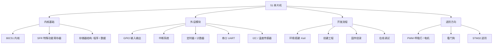

51 单片机泛指以 Intel **80C51 内核**为基础的一系列 8 位单片机，因指令系统简单、资料丰富、价格低廉，长期作为嵌入式入门的首选平台。课程中常用的国产型号是 STC（宏晶）的 STC8052RC。

> [!info] 一句话定位
> 51 单片机 = 80C51 内核的 8 位 MCU，是理解「寄存器编程 + 外设驱动」的最佳入门载体。

## 知识体系

## 学习路线（14 个实践点）

> [!example]- 学习清单
> - 1. [[单片机介绍]]
> - 2. 环境搭建
> - 3. 创建工程
> - 4. 固件烧录
> - 5. 点亮 LED
> - 6. 按键
> - 7. 数码管
> - 8. 中断
> - 9. 定时器
> - 10. 串口通讯
> - 11. 蜂鸣器
> - 12. IIC、温度传感器
> - 13. PWM、呼吸灯、直流电机
> - 14. [[看门狗]]

## 核心要点

- **寄存器编程**：51 通过操作 SFR（如 `P1`、`TMOD`、`SCON`）直接控制硬件，是理解「软件如何驱动硬件」的最直接路径。
- **存储器结构**：程序存储器与数据存储器分开，属**哈佛结构**。
- **中断系统**：5 个中断源（外部 0/1、定时器 0/1、串口），理解中断向量与优先级是所有 MCU 的通用技能。
- **定时器**：通过初值计算实现精确延时与计数，是 PWM、测频的基础。
- **串口通信**：UART 是单片机与 PC、模块通信的标配。
- **外设扩展**：I2C 接温度传感器、PWM 控电机，把单片机用起来。
- **下一步**：当 8 位不够用时，自然过渡到 [[STM32]] 与 [[RTOS]]。

## 相关

- [[单片机介绍]]
- [[MCU]]
- [[STM32]]
- [[看门狗]]
- [[电子基础]]
