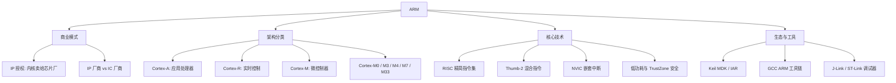

ARM 是一家英国芯片 IP 设计公司（ARM Holdings），它本身不生产芯片，而是**把处理器内核设计授权给芯片厂商**。ARM 架构是当今嵌入式与移动领域的绝对主流：手机、单片机、汽车 ECU、服务器（如 Graviton、鲲鹏）中都能见到它。

> [!info] 一句话定位
> ARM = 一家做「CPU 内核图纸」的公司 + 一套以低功耗著称的 RISC 指令集架构。

## 知识体系

## 核心要点

- **IP 商业模式**：ARM 设计内核，授权给 ST、NXP、TI、高通等芯片厂，后者在内核基础上添加外设做出各自的 MCU / SoC。
- **三大产品线**：
  - **Cortex-A**：跑 Linux / Android 的应用处理器（手机、平板）。
  - **Cortex-R**：面向实时性与可靠性的场景（汽车、硬盘控制器）。
  - **Cortex-M**：通用微控制器内核，[[STM32]]、[[MCU]] 的主角。
- **RISC 特性**：指令固定长度、流水线友好、功耗低，是 ARM 能耗优势的根源。
- **NVIC**：Cortex-M 的内置中断控制器，是嵌入式实时响应的基础。
- **与 x86 对比**：x86 走 CISC + 复杂生态（PC / 服务器），ARM 走 RISC + 低功耗（移动 / 嵌入式），详见 [[处理器架构]]、[[X86]]。

## 相关

- [[STM32]]
- [[MCU]]
- [[处理器架构]]
- [[X86]]
- [[RTOS]]
