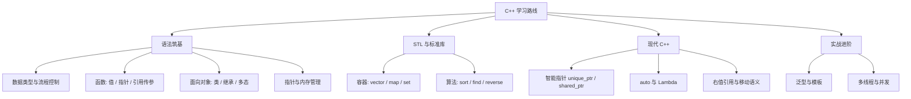

> [!info] 一句话定位
> C++ = C 的性能 + 面向对象 + 泛型编程 + 现代内存管理，一把「既底层又高层」的瑞士军刀。

## 知识体系

学习 C++ 是一条从理解底层硬件机制到掌握高层抽象艺术的修行之路。C++ 既有 C 语言操作内存的极致性能，又有现代面向对象、泛型编程的高级特性，被誉为编程语言中的“瑞士军刀”。
为了让你能高效、不踩坑地精通 C++，我为你梳理了一份从零基础到进阶的结构化学习路线。

---

## 🗺️ 第一阶段：语法筑基（攻克 C++ 的“硬核”底层）
这个阶段的核心是把基础打牢，特别是 C++ 区别于其他高层语言（如 Python、Java）的独有特性。

* 四大核心基础：
* 控制结构与基本语法：数据类型、条件分支、循环。
   * 函数：理解值传递（Pass by Value）、指针传递与引用传递（Pass by Reference）的本质区别。
   * 面向对象（OOP）：类与对象、封装、继承、多态（虚函数 virtual 与虚函数表原理）。
* ⚠️ 必过难关：指针与内存管理：
* 理解指针与地址的关系、数组与指针的转化。
   * 搞懂内存的栈区（Stack）与堆区（Heap）：什么时候用 new / delete？
   * 掌握深拷贝与浅拷贝，理解析构函数在防止内存泄漏中的作用。

---
## 库与现代 C++（告别“老古董”写法）
现代 C++（Modern C++） 指的是 C++11 及其之后的标准（C++14/17/20）。现代 C++ 极大地简化了指针管理，让代码更加安全和高效。

* 标准模板库（STL） —— 必须滚瓜烂熟的核心工具箱：
* 容器（Containers）：std::vector（动态数组）、std::list（链表）、std::map / std::unordered_map（键值对映射）。
   * 算法（Algorithms）：std::sort（排序）、std::find（查找）、std::reverse（反转）。
* 现代 C++ 必学核心特性：
* 智能指针（Smart Pointers）：完全抛弃 new/delete！学会使用 std::unique_ptr（独占）和 std::shared_ptr（共享）来自动管理内存。
   * 自动类型推导：auto 关键字。
   * Lambda 表达式：匿名函数，让 STL 算法组合更丝滑。
   * 右值引用与移动语义（Move Semantics）：C++ 性能飞跃的秘密，减少无意义的内存复制。

---
## 🛠️ 第三阶段：实战进阶与底层透视
掌握了语法后，必须通过做项目来将知识“固化”。

* 进阶硬核技术：
* 泛型编程：模板（Template）类与模板函数，理解 C++ 的编译期动态。
   * 多线程与并发：std::thread、std::mutex（互斥锁）、条件变量。
* 推荐实战项目清单（由易到难）：
1. 命令行管理系统（如：学生成绩管理系统）：练手 OOP 结构设计。
   2. 用 STL 实现一个自己的小工具（如：迷你 Redis 键值内存数据库）。
   3. 网络聊天室：使用套接字（Socket）编程，掌握高并发网络通信。
   4. 小游戏引擎（如使用 SFML 或 SDL 库）：制作贪吃蛇、飞机大战，深度体会 C++ 的性能和图形渲染。

---

## 📚 避坑指南：给 C++ 学习者的两点忠告

   1. 不要去看陈旧的教材！ 坚决丢掉市面上十几年前基于 C++98（甚至 Turbo C++）的过时书籍。拥抱 C++11 起步的现代教材。
   2. 注重编译与调试：C++ 的报错信息常常劝退新手。尽早学会看编译错误，熟练使用 GDB 或 Visual Studio 的断点调试，观察内存中变量地址的变化，能让你对底层原理瞬间通透。

---

## 📖 顶级书单推荐（按阅读顺序）

* 入门推荐：《C++ Primer Plus》 或 《C++ Primer》（第五版，经典中的经典）。
* 进阶必读：《Effective C++》（教你写出高质量、避免踩坑的 C++ 代码）。
* 现代 C++ 进阶：《Effective Modern C++》（专攻 C++11/14 新特性）。

