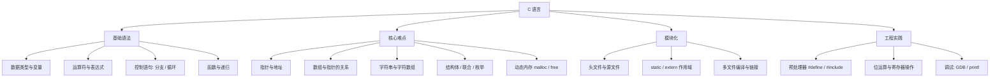

C 语言是**嵌入式与系统编程的通用语言**：它贴近硬件、语法精简、可移植性强，几乎所有操作系统内核、编译器和 [[MCU]] 固件都由 C 写成。学 C 不只是学语法，更是理解「内存、指针、编译链接」的入口。

> [!info] 一句话定位
> C = 一门「小而深」的语言：语法少，但指针与内存模型足够陪你走完整个职业生涯。

## 知识体系

## 章节要点

### 第一章 初识 C 语言
- 编译流程：预处理 → 编译 → 汇编 → 链接，最终得到可执行文件。
- 第一个程序：`#include <stdio.h>` + `main` 函数 + `printf`。

### 第二章 C 语言概述
- 程序结构、标识符命名规则、注释、`main` 的返回值。

### 第三章 数据和 C
- 基本类型：`int` / `char` / `float` / `double` 及 `short` / `long` / `unsigned` 修饰。
- 进制、常量与变量、类型转换（隐式与强制）。

### 第四章 字符串和格式化输入/输出
- `printf` / `scanf` 的格式说明符；`gets` / `fgets` 的坑。
- 字符串本质是**以 `\0` 结尾的字符数组**。

### 第五章 运算符、表达式和语句
- 算术、关系、逻辑、位、三目运算符；自增自减的求值顺序陷阱。

### 第六章 控制语句：循环
- `for` / `while` / `do-while` 的适用场景与互转。

### 第七章 控制语句：分支和跳转
- `if-else` 嵌套、`switch-case`、`break` / `continue` / `goto`。

## 核心难点：指针

- **指针就是地址**：`int *p = &a;`，`*p` 取内容，`&a` 取地址。
- **数组名即首元素地址**：`arr[i]` 等价于 `*(arr + i)`。
- **函数传参**：C 只有值传递，想修改外部变量就得传指针。
- **动态内存**：`malloc` 配 `free`，配对使用，避免内存泄漏与野指针。

## 相关

- [[CPP]]
- [[数据结构与算法]]
- [[STM32]]
- [[电子基础]]
