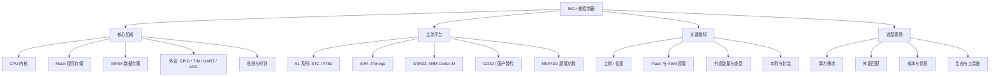

MCU（Microcontroller Unit，微控制器）俗称**单片机**，是把 CPU 核心、存储器（Flash / RAM）、各种外设（GPIO、定时器、串口、ADC…）集成到**一块芯片**上的微型计算机。它的使命是「控制」——体积小、功耗低、成本低、实时性强。

> [!info] 一句话定位
> MCU = CPU + 存储 + 外设，集成在一颗芯片上，专为嵌入式控制而生。

## 知识体系

## 核心要点

- **与 CPU 的区别**：CPU（如 x86）追求算力，MCU 追求集成度、实时性和低功耗。
- **冯·诺依曼 vs 哈佛**：多数 MCU 采用**哈佛架构**，程序与数据分开存储、可同时访问，取指与取数不冲突。
- **主流平台**：8 位的 51、AVR 适合入门与简单控制；32 位的 STM32（Cortex-M）是工业主流；GD32 等国产替代快速崛起。
- **选型四要素**：**算力够用、外设匹配、成本可控、供货稳定**——切忌盲目追求高性能。
- **开发方式**：从寄存器 → 标准库 → HAL 库，抽象层次越高开发越快，但也要理解底层。

## 相关

- [[单片机介绍]]
- [[51单片机]]
- [[STM32]]
- [[ARM]]
- [[RTOS]]
- [[常用芯片手册]]
