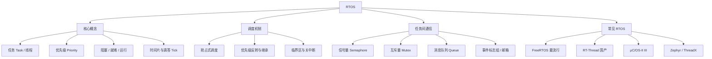

RTOS（Real-Time Operating System，实时操作系统）是面向嵌入式场景裁剪过的操作系统。它的核心目标不是「吞吐量最大」，而是**任务响应时间的可预测性**——保证关键任务在确定的时限内得到执行。

> [!info] 一句话定位
> RTOS = 能跑在单片机上、以「确定性」和「实时性」为第一目标的迷你操作系统。

## 知识体系

## 核心要点

- **硬实时 vs 软实时**：硬实时（如刹车控制）超时即失败；软实时（如视频播放）偶有超时可接受。
- **任务与优先级**：RTOS 把程序拆成多个独立任务，每个任务有优先级，高优先级任务可**抢占**低优先级任务。
- **调度器**：抢占式 + 时间片轮转是主流；就绪表中总是运行最高优先级任务。
- **优先级反转**：低优先级任务持有高优先级任务需要的锁时会导致高优先级阻塞，用**优先级继承**解决。
- **任务通信**：任务间不直接共享变量，而是用信号量、互斥量、消息队列、事件标志组来同步与传数据。
- **裸机 vs RTOS**：裸机的「前后台 + 状态机」简单但难扩展；任务一多、实时性要求一高，就该上 RTOS。
- **最小系统**：Tick 定时器 + 调度器 + 任务栈管理，是 RTOS 的心脏。

## 与前后台架构对比

| 维度 | 裸机前后台 | RTOS |
| --- | --- | --- |
| 结构 | 主循环 + 中断 | 多任务并发 |
| 实时性 | 靠中断和拆分 | 靠优先级抢占 |
| 可扩展性 | 差 | 好 |
| 内存开销 | 极小 | 较大 |

## 相关

- [[操作系统]]
- [[STM32]]
- [[MCU]]
- [[看门狗]]
