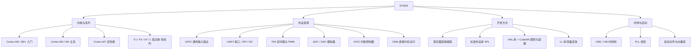

STM32 是意法半导体（STMicroelectronics，ST）基于 **ARM Cortex-M 内核**推出的 32 位微控制器（MCU）家族，是当前嵌入式领域应用最广、生态最成熟的 MCU 之一。它以「内核 + 丰富外设 + 完善工具链」著称，从学生实验到工业量产都能覆盖。

> [!info] 一句话定位
> STM32 = 一颗 ARM Cortex-M 核心 + 一堆可配置外设（GPIO/UART/SPI/I2C/ADC/TIM…）+ ST 的 HAL 库与 CubeMX 工具。

## 知识体系

## 核心要点

- **内核与外设分离**：内核由 ARM 授权（IP 厂商），外设由 ST 设计（IC 厂商），这也是 [[单片机介绍]] 中讲的 IP 模式。
- **GPIO 八种模式**：输入（浮空/上拉/下拉/模拟）、输出（推挽/开漏）、复用、模拟，配置错了现象就不对。
- **时钟树**：STM32 上电默认用内部高速时钟（HSI），工程里几乎都要配置 PLL 把主频拉到最高，**忘记开外设时钟**是新手最常见错误。
- **中断与 NVIC**：Cortex-M 的嵌套向量中断控制器支持优先级抢占，是实时响应外设的关键。
- **DMA**：让外设和内存直接搬数据，不占用 CPU，串口高速收发、ADC 连续采样必备。
- **HAL + CubeMX**：图形化生成初始化代码，大幅降低门槛；想抠性能再回到寄存器或 LL 库。

## 学习路径

1. GPIO 点灯与按键 → 2. 中断与 EXTI → 3. 定时器与 PWM → 4. 串口 UART 通信 → 5. ADC 采集 → 6. I2C/SPI 驱动传感器与屏幕 → 7. DMA → 8. [[RTOS]] 多任务。

## 相关

- [[ARM]]
- [[MCU]]
- [[51单片机]]
- [[RTOS]]
- [[常用芯片手册]]
