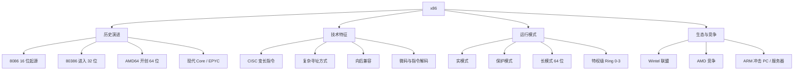

x86 是 Intel 于 1978 年随 8086 处理器推出的指令集架构家族，因早期型号以 86 结尾得名。它是**CISC 架构的代表**，统治了 PC 与服务器市场四十余年；64 位版本（x86-64 / AMD64）由 AMD 首创并被 Intel 采用，延续至今。

> [!info] 一句话定位
> x86 = PC 与服务器的「母语」，用兼容性和生态赢下了桌面与数据中心。

## 知识体系

## 核心要点

- **CISC 特征**：指令变长、功能复杂、寻址方式多，单条指令能完成较多工作，但解码与流水线设计更难。
- **向后兼容的代价与红利**：老软件能在新 CPU 上运行是 x86 的护城河，但也让架构背负历史包袱。
- **运行模式**：从实模式（16 位）→ 保护模式（32 位，内存保护与分页）→ 长模式（64 位），支撑现代 [[操作系统]] 的虚拟内存与权限隔离。
- **特权级**：Ring 0 内核态 / Ring 3 用户态，是系统调用与安全隔离的硬件基础。
- **与 ARM 之争**：x86 强在性能与生态（PC / 服务器），ARM 强在能效（移动 / 嵌入式）；苹果 M 系列和服务器 ARM 芯片正在打破边界，详见 [[ARM]]、[[处理器架构]]。

## 相关

- [[处理器架构]]
- [[ARM]]
- [[计算机组成原理]]
- [[操作系统]]
