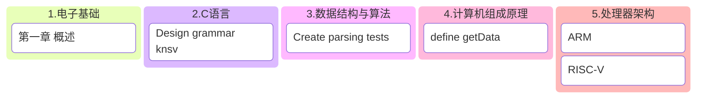

学习[[EE]]

```mermaid
kanban
  [1.电子基础]
    [第一章 概述]
  [2.C语言]
    [Design grammar]@{ ticket: 'knsv' }
  [3.数据结构与算法]
    [Create parsing tests]
  [4.计算机组成原理]
    [define getData] 
  [5.处理器架构]
    [ARM]
    [RISC-V]
```