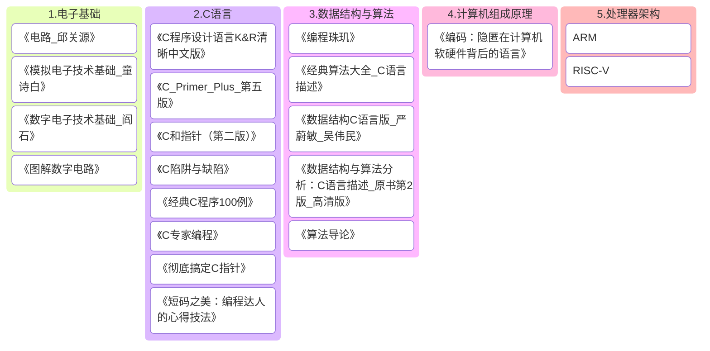
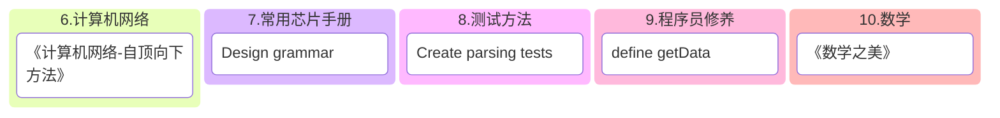
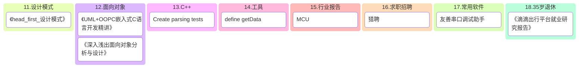

学习[[EE]]

```mermaid
kanban
  [1.电子基础]
    [《电路_邱关源》]
    [《模拟电子技术基础_童诗白》]
    [《数字电子技术基础_阎石》]
    [《图解数字电路》]
  [2.C语言]
    [《C程序设计语言K&R清晰中文版》]
    [《C_Primer_Plus_第五版》]
    [《C和指针（第二版）》]
    [《C陷阱与缺陷》]
    [《经典C程序100例》]
    [《C专家编程》]
    [《彻底搞定C指针》]
    [《短码之美：编程达人的心得技法》]
  [3.数据结构与算法]
    [《编程珠玑》]
    [《经典算法大全_C语言描述》]
    [《数据结构C语言版_严蔚敏_吴伟民》]
    [《数据结构与算法分析：C语言描述_原书第2版_高清版》]
    [《算法导论》]
  [4.计算机组成原理]
    [《编码：隐匿在计算机软硬件背后的语言》] 
  [5.处理器架构]
    [ARM]
    [RISC-V]
```

```mermaid
kanban
  [6.计算机网络]
    [《计算机网络-自顶向下方法》]
  [7.常用芯片手册]
    [Design grammar]
  [8.测试方法]
    [Create parsing tests]
  [9.程序员修养]
    [define getData] 
  [10.数学]
    [《数学之美》]
```

```mermaid
kanban
  [11.设计模式]
    [《head_first_设计模式》]
  [12.面向对象]
    [《UML+OOPC嵌入式C语言开发精讲》]
    [《深入浅出面向对象分析与设计》]
  [13.C++]
    [Create parsing tests]
  [14.工具]
    [define getData] 
  [15.行业报告]
    [MCU]
  [16.求职招聘]
    [猎聘]
  [17.常用软件]
    [友善串口调试助手]
  [18.35岁退休]
    [《滴滴出行平台就业研究报告》]
```