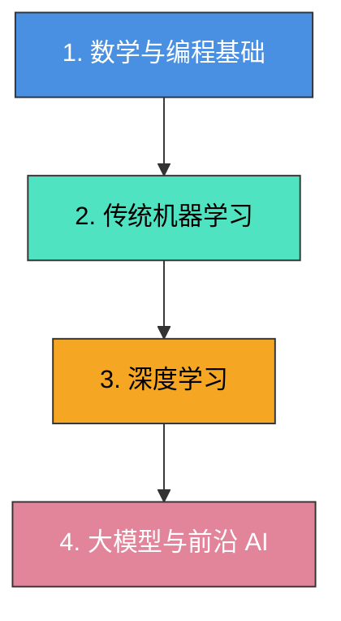

人工智能（AI）学习是一个跨学科的系统工程，它融合了计算机科学、数学和特定领域的应用知识。当前 AI 的核心驱动力是机器学习（Machine Learning），尤其是基于深度神经网络的深度学习（Deep Learning）和大语言模型（LLM）。

---

### 1. 核心知识体系
可以将 AI 的学习路径分为以下四个核心层次：

### ① 数学与编程基础（地基）

* 数学三剑客：线性代数（矩阵运算、特征值）、微积分（导数、梯度下降）、概率论与数理统计（贝叶斯定理、随机变量）。
* 编程语言：Python 是绝对的主流（掌握 NumPy, Pandas, Matplotlib 等基础库）。

### ② 传统机器学习（基石）

* 监督学习：线性回归、逻辑回归、支持向量机（SVM）、决策树、随机森林。
* 无监督学习：K-Means 聚类、PCA 降维。
* 核心概念：过拟合、欠拟合、交叉验证、模型评估指标（准确率、召回率、F1 分数）。

### ③ 深度学习（主力）

* 神经网络基础：多层感知机（MLP）、激活函数（ReLU, Sigmoid）、反向传播算法。
* 经典架构：
* CNN（卷积神经网络）：主攻图像/计算机视觉（CV）。
   * RNN/LSTM（循环神经网络）：传统文本/时间序列处理。
* 主流框架：PyTorch（目前学术界和工业界最推荐）或 TensorFlow。

### ④ 大模型与前沿 AI（当下热门）

* Transformer 架构：自注意力机制（Self-Attention），现代大模型（LLM）的底层逻辑。
* 生成式 AI (GenAI)：Prompt 工程、大模型微调（LoRA 等）、RAG（检索增强生成）、AI Agent（智能体）开发。

------------------------------
### 2. 实用学习路线建议

  1. 拒绝纯看书，从项目驱动：不要试图先把数学全部学完再写代码。推荐通过现成的案例（如 Kaggle 经典的“泰坦尼克号生存预测”或“手写数字识别 MNIST”）直接上手。
  2. 经典课程推荐：
   * 吴恩达（Andrew Ng）的《Machine Learning Specialization》（适合零基础入门）。
   * 李沐的《动手学深度学习》（Dive into Deep Learning，兼顾理论与 PyTorch 代码）。
  3. 拥抱 AI 工具：在学习过程中，善用 ChatGPT/Claude 帮你解释看不懂的公式或调试 Bug。

