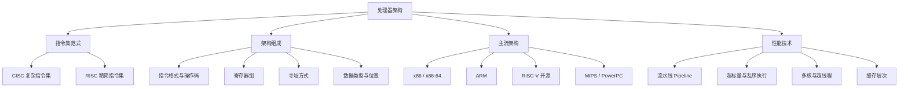

处理器架构（Processor Architecture）是处理器**对外呈现的抽象模型**，即软件看到的指令集与编程模型，也就是 ISA（Instruction Set Architecture）。它决定了「一条指令长什么样、怎么寻址、有多少寄存器」，是软件与硬件之间的契约。

> [!info] 一句话定位
> 处理器架构 = 指令集架构（ISA）：软件与硬件之间签的那份「合同」。

## 知识体系

## CISC vs RISC

| 维度 | CISC（复杂指令集） | RISC（精简指令集） |
| --- | --- | --- |
| 代表 | x86 | ARM、RISC-V、MIPS |
| 指令长度 | 变长 | 定长 |
| 指令复杂度 | 单条指令功能强 | 指令简单、组合完成 |
| 流水线 | 较难 | 天然友好 |
| 典型场景 | PC、服务器 | 移动、嵌入式 |

## 核心要点

- **ISA 是分层关键**：同一份软件只要 ISA 相同就能运行，与微架构实现无关，这就是二进制兼容的基础。
- **RISC 的胜利**：RISC 把复杂操作拆成简单指令组合，流水线更高效、功耗更低，是移动与嵌入式的主流。
- **x86 的兼容包袱**：x86 靠历史生态取胜，但 CISC 解码复杂、功耗高，因此在移动端不占优。
- **RISC-V 开源**：免费开放的指令集，正在物联网、AI 加速器领域快速扩张。
- **微架构 ≠ 架构**：架构是「给软件看的」，微架构是「硬件怎么实现」，如超标量、乱序、分支预测。
- **与之相关的课程**：架构的具体电路实现见 [[计算机组成原理]]，具体 CPU 产品见 [[ARM]]、[[X86]]。

## 相关

- [[计算机组成原理]]
- [[ARM]]
- [[X86]]
- [[数字电路]]
- [[操作系统]]
