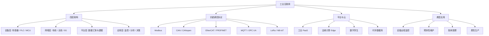

工业互联网（Industrial Internet / IIoT）是把**互联网、云计算、大数据与工业现场设备深度融合**的产物。它让机器、产线、工厂乃至供应链彼此「对话」，实现远程监控、预测性维护和生产优化，是智能制造的核心基础设施。

> [!info] 一句话定位
> 工业互联网 = 工业设备 + 网络连接 + 云平台 + 数据分析，让工厂「会说话、能自省」。

## 知识体系

## 核心要点

- **架构分层**：设备层采集 → 网络层传输 → 平台层汇聚建模 → 应用层决策，与物联网（IoT）架构一脉相承。
- **工业协议多样**：现场总线（Modbus、CAN、EtherCAT）负责实时控制；上层用 **MQTT、OPC UA** 打通 IT 与 OT。
- **OT 与 IT 融合**：运营技术（OT，现场控制）与信息技术（IT，数据分析）打通，是工业互联网的价值所在，也带来安全挑战。
- **边缘计算**：在靠近设备处先做数据清洗与实时判断，降低云端压力与延迟。
- **数字孪生**：用数据在云上复刻物理设备，实现仿真、预测与优化。
- **嵌入式角色**：[[MCU]]、[[STM32]] 常作为设备层网关，负责协议转换与数据上云。

## 相关

- [[MCU]]
- [[STM32]]
- [[RTOS]]
- [[计算机网络]]
- [[人工智能]]
