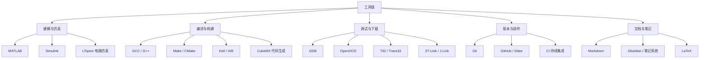

工具链决定了嵌入式与软件开发的效率上限。从**建模仿真**到**编译调试**，再到**版本管理**，每一步都有成熟工具可用。会用工具的人，做同样的事能少花一半时间。

> [!info] 一句话定位
> 工具 = 把重复劳动交给机器，把人的时间留给真正的问题。

## 知识体系

## 核心要点

- **建模仿真**：MATLAB 做算法与数据分析，Simulink 做模型化设计，LTspice / Multisim 做电路仿真——**先仿真后上板**能省下大量试错成本。
- **编译构建**：GCC/G++ 是 Linux 下标配；`Make` / `CMake` 管理多文件工程；Keil / IAR 是单片机主流 IDE。
- **调试下载**：GDB 是命令行调试之王；OpenOCD + ST-Link / J-Link 负责烧录与在线调试；T32 常见于汽车电子。
- **版本管理**：Git 是事实标准，善用分支和提交历史。
- **文档笔记**：Markdown + [[数字花园]] 这套组合，让知识可积累、可检索、可分享。
- **一条建议**：工具不用全学会，围绕「建模—编码—调试—协作」四条线，各精通一两个即可。

## 相关

- [[程序员修养]]
- [[51单片机]]
- [[STM32]]
- [[数字花园]]
