芯片手册（Datasheet）是硬件工程师的「字典」：它用几十到上千页精确描述一颗芯片的引脚、电气特性、寄存器、时序和封装。**会读手册，是嵌入式工程师从「跟着教程做」走向「独立开发」的分水岭。**

> [!info] 一句话定位
> Datasheet = 芯片的官方说明书，一切设计争议以它为准。

## 知识体系

```mermaid
flowchart TD
    A[芯片手册] --> B[手册种类]
    A --> C[关键章节]
    A --> D[阅读方法]
    A --> E[常见芯片]

    B --> B1["Datasheet 数据手册"]
    B --> B2["Reference Manual 参考手册"]
    B --> B3["Errata 勘误表"]
    B --> B4["App Note 应用笔记"]

    C --> C1["Feature 特性概览"]
    C --> C2["Pinout 引脚定义"]
    C --> C3["Absolute Maximum 极限参数"]
    C --> C4["电气特性 Electrical Characteristics"]
    C --> C5["寄存器映射 Register Map"]
    C --> C6["时序图 Timing Diagram"]

    D --> D1["先看 Feature 和框图"]
    D --> D2["再查引脚和电气参数"]
    D --> D3["重点抠时序和寄存器"]
    D --> D4["必看勘误表 Errata"]

    E --> E1["MCU: STM32 / GD32"]
    E --> E2["电源: LDO / DCDC"]
    E --> E3["接口: I2C / SPI / CAN 收发"]
    E --> E4["传感器: 温湿度 / 加速度计"]
```

## 核心要点

- **两类手册别搞混**：**Datasheet** 偏电气与引脚（怎么接线、能承受多大电压电流）；**Reference Manual** 偏寄存器与功能（怎么编程）。两者常配套使用。
- **极限参数（Absolute Maximum）**：超过就烧芯片，是所有设计的第一条红线。
- **时序图（Timing Diagram）**：I2C、SPI、CAN 等接口能否调通，全看时序参数是否满足。
- **寄存器映射**：裸机编程的核心依据，直接对应 [[STM32]] 的配置过程。
- **勘误表（Errata）必看**：厂商承认的芯片 Bug 与规避方法，量产前一定核对。
- **高效阅读法**：带着问题查手册，别从头读到尾——先用 Feature 和框图建立全局，再定位到具体章节。

## 相关

- [[STM32]]
- [[51单片机]]
- [[MCU]]
- [[模拟电路]]
