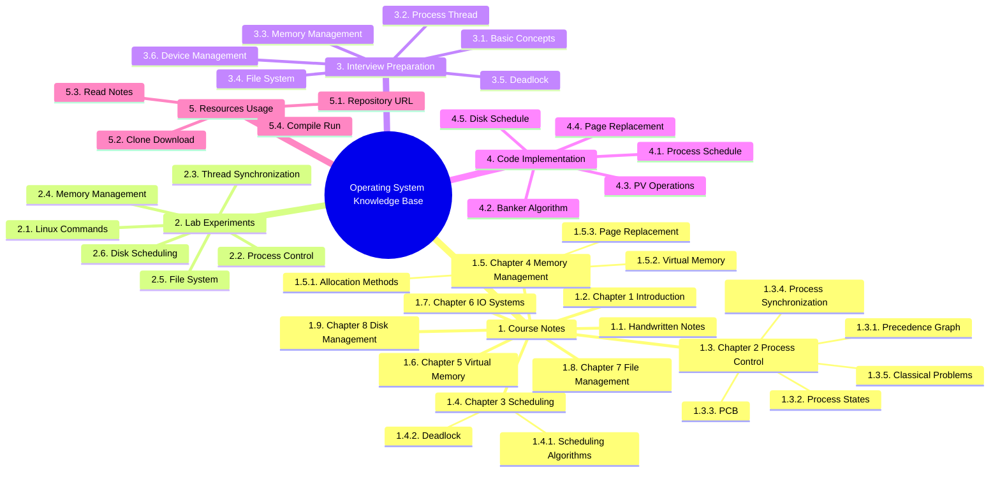

## 概述

在计算机中，操作系统是其最基本也是最为重要的基础性系统软件。从计算机用户的角度来说，计算机操作系统体现为其提供的各项服务；从程序员的角度来说，其主要是指用户登录的界面或者接口；如果从设计人员的角度来说，就是指各式各样模块和单元之间的联系。事实上，全新操作系统的设计和改良的关键工作就是对体系结构的设计，经过几十年以来的发展，计算机操作系统已经由一开始的简单控制循环体发展成为较为复杂的分布式操作系统，再加上计算机用户需求的愈发多样化，计算机操作系统已经成为既复杂而又庞大的计算机软件系统之一。

> [!example]- 操作系统
>
> - 第一章 操作系统引论
> - 第二章 进程的描述与控制
> - 第三章 处理机调度与死锁
> - 第四章 存储器管理
> - 第五章 虚拟存储器
> - 第六章 输入输出系统
> - 第七章 文件管理
> - 第八章 磁盘存储器的管理

> [!note] Behaviour of references
>
> By default, the references will be included at the end of the file. To control where the references to be included, uses `[^ref]`
>
> Refer to `rehype-citation` docs for more information.

## 思维导图

