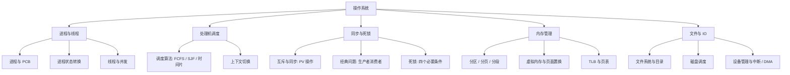

操作系统（Operating System，OS）是管理计算机硬件资源、并为应用程序提供运行环境的**系统软件**。它是硬件与应用之间的桥梁：向下屏蔽硬件差异，向上提供统一的抽象（进程、文件、内存、设备）。

> [!info] 一句话定位
> 操作系统就是「资源的分配者 + 抽象的提供者」：把 CPU、内存、外设调度好，再把它们包装成进程、虚拟内存、文件等好用的概念。

## 知识体系

```mermaid
flowchart TD
    A[操作系统] --> B[进程与线程]
    A --> C[处理机调度]
    A --> D[同步与死锁]
    A --> E[内存管理]
    A --> F[文件与 IO]

    B --> B1["进程与 PCB"]
    B --> B2["进程状态转换"]
    B --> B3["线程与并发"]

    C --> C1["调度算法: FCFS / SJF / 时间片"]
    C --> C2["上下文切换"]

    D --> D1["互斥与同步: PV 操作"]
    D --> D2["经典问题: 生产者消费者"]
    D --> D3["死锁: 四个必要条件"]

    E --> E1["分区 / 分页 / 分段"]
    E --> E2["虚拟内存与页面置换"]
    E --> E3["TLB 与页表"]

    F --> F1["文件系统与目录"]
    F --> F2["磁盘调度"]
    F --> F3["设备管理与中断 / DMA"]
```

## 核心要点

- **进程与线程**：进程是资源分配的基本单位，线程是调度的基本单位；进程靠 **PCB** 记录运行状态。
- **进程状态**：就绪 → 运行 → 阻塞，加上新建与终止，构成状态机。
- **调度算法**：先来先服务（FCFS）、短作业优先（SJF）、时间片轮转（RR）、优先级调度、多级反馈队列，权衡的是**吞吐量、响应时间、公平性**。
- **同步与互斥**：用**信号量 + PV 操作**解决并发竞争；经典模型有生产者-消费者、读者-写者、哲学家进餐。
- **死锁**：互斥、占用并等待、不可剥夺、循环等待四个条件同时成立才会死锁；对策是预防、避免（银行家算法）、检测与解除。
- **内存管理**：从连续分配到**分页 / 分段**，再到**虚拟内存**，让进程拥有独立且远大于物理内存的地址空间。
- **页面置换**：FIFO、LRU、Clock，配合 TLB 和页表实现高效地址转换。
- **文件与 IO**：文件系统管理数据的组织与持久化；IO 从查询、中断进化到 **DMA** 方式。

## 与其它学科的连接

- 上承 [[计算机组成原理]] 的硬件结构；
- 下启 [[计算机网络]] 的系统调用与协议栈实现；
- 与 [[数据结构与算法]] 在调度、置换、查找中深度重合；
- 嵌入式场景下的裁剪版本即 [[RTOS]]。

## 相关

- [[计算机组成原理]]
- [[RTOS]]
- [[Linux]]
- 参考教材：《计算机操作系统》（汤小丹）/ OSTEP
