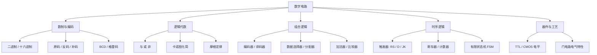

数字电路（Digital Circuit）研究用**离散的 0 / 1 电平**来表示和处理信息的电路。相比模拟电路关注连续量，数字电路关注「逻辑」，是计算机、单片机和一切数字系统最底层的物理实现基础。

> [!info] 一句话定位
> 从「晶体管开关」到「与或非门」，再到「加法器和触发器」，数字电路要把逻辑运算用电路搭出来。

## 知识体系

## 核心要点

- **数制与编码**：二进制是数字系统的语言；**补码**是计算机用加法实现减法的关键。
- **逻辑代数**：布尔代数是数字电路的数学基础，用**卡诺图**或公式法化简逻辑表达式，直接决定电路规模。
- **组合逻辑**：输出只取决于当前输入，无记忆。典型有编码器、译码器、加法器、多路选择器。
- **时序逻辑**：输出还取决于历史状态，靠**触发器**存储 1 位信息，是寄存器、计数器、状态机的基础。
- **关键器件**：**CMOS** 因功耗低、集成度高，成为现代芯片主流工艺。
- **从门到系统**：门电路 → 加法器/寄存器 → 累加器与控制器 → 微处理器，这条链路把数字电路与 [[计算机组成原理]] 连起来。

## 学习路径

1. 数制与编码 → 2. 布尔代数与化简 → 3. 门电路 → 4. 组合逻辑 → 5. 触发器与时序逻辑 → 6. 可编程逻辑器件（CPLD / FPGA）。

## 相关

- [[模拟电路]]
- [[电子基础]]
- [[计算机组成原理]]
- [[处理器架构]]
