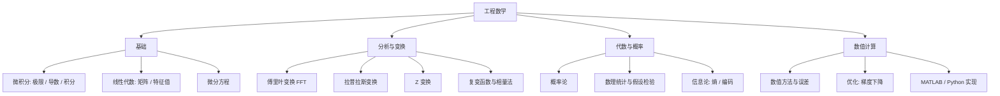

数学是工程与算法的底层语言。对电子与嵌入式方向的人来说，最核心的不是刷难题，而是**建立用数学描述问题的能力**：电路分析要用微积分与复变，信号处理要用傅里叶变换，控制要用状态空间，AI 要用线性代数与概率统计。

> [!info] 一句话定位
> 工程数学 = 把物理世界的问题翻译成方程，再用工具解出来。

## 知识体系

## 核心要点

- **微积分**：描述「变化」的工具，导数对应变化率（电流是电荷的变化率），积分对应累积。
- **线性代数**：现代工程最实用的数学。矩阵是线性变换，特征值/特征向量揭示系统的固有特性。
- **傅里叶与拉普拉斯变换**：把时域问题转到频域/复频域求解，是信号处理与电路分析的核心武器。
- **复变与相量法**：让正弦稳态电路分析从解微分方程变成代数运算，见 [[模拟电路]]。
- **概率与统计**：处理噪声、不确定性和数据，是测量、通信与 AI 的基础。
- **数值方法**：计算机不会解析求解，实际都要靠数值算法（如 FFT、牛顿迭代、梯度下降）。
- **和 AI 的关系**：见 [[人工智能]]，机器学习的三大数学支柱正是线代、微积分、概率统计。

## 学习建议

- 结合**具体场景**学数学（学傅里叶就去看滤波器），比抽象推导更有效。
- 用 MATLAB / Python 把公式画出来、跑起来，建立直觉。
- 推荐读物：《数学之美》《线性代数的本质》。

## 相关

- [[人工智能]]
- [[数据结构与算法]]
- [[模拟电路]]
- [[计算机组成原理]]
