数据结构与算法是计算机科学的核心基石，它决定了程序的执行效率（速度）和资源消耗（内存）。简单来说，数据结构是数据的存储方式，而算法是解决问题的具体步骤。

---

```mermaid

graph TD
    %% 核心节点
    Root([数据结构与算法])

    %% 数据结构板块
    Root --> DS[数据结构: 数据的存储方式]
    
    DS --> DS_Linear[线性结构]
    DS_Linear --> Array[数组 Array: 连续内存/随机访问]
    DS_Linear --> List[链表 Linked List: 指针连接/动态扩容]
    DS_Linear --> Stack[栈 Stack: 后进先出 LIFO]
    DS_Linear --> Queue[队列 Queue: 先进先出 FIFO]
    
    DS --> DS_Tree[树形结构]
    DS_Tree --> BinTree[二叉树 Binary Tree: 基础树状模型]
    DS_Tree --> BST[二叉搜索树: 左小右大/便于查找]
    DS_Tree --> Heap[堆 Heap: 大顶堆/小顶堆/优先队列]
    
    DS --> DS_Graph[图形结构]
    DS_Graph --> AM[邻接矩阵: 二维数组存储]
    DS_Graph --> AL[邻接表: 链表数组存储]
    
    DS --> DS_Hash[哈希结构]
    DS_Hash --> HashTable[散列表 Hash Table: Key-Value映射/O_1查询]

    %% 算法板块
    Root --> Alg[算法: 解决问题的步骤]
    
    Alg --> Alg_Analysis[复杂度分析]
    Alg_Analysis --> Time_Comp[时间复杂度: 运行趋势 O_1, O_log n, O_n]
    Alg_Analysis --> Space_Comp[空间复杂度: 额外内存消耗]
    
    Alg --> Alg_Sort[排序与搜索]
    Alg_Sort --> Sort[排序: 快排 / 归并 / 堆排]
    Alg_Sort --> Search[搜索: 二分查找 / 广度优先 BFS / 深度优先 DFS]
    
    Alg --> Alg_Strategy[高级算法策略]
    Alg_Strategy --> DC[分治法 Divide & Conquer: 大化小/如归并排序]
    Alg_Strategy --> Greedy[贪心算法 Greedy: 每步局部最优]
    Alg_Strategy --> DP[动态规划 Dynamic Programming: 状态转移/重叠子问题]
    Alg_Strategy --> Backtrack[回溯法 Backtracking: 试探回溯/如八皇后]

    %% 样式调整
    style Root fill:#4A90E2,stroke:#333,stroke-width:2px,color:#fff
    style DS fill:#50E3C2,stroke:#333,stroke-width:1px
    style Alg fill:#F5A623,stroke:#333,stroke-width:1px

```

## 1. 核心组成部分

为了系统地学习，可以将其分为两大板块：

## 基础数据结构

* 线性结构：数组（Array）、链表（Linked List）、栈（Stack）、队列（Queue）。
* 树形结构：二叉树（Binary Tree）、二叉搜索树（BST）、平衡树（AVL/红黑树）、堆（Heap）。
* 图形结构：图（Graph，包括邻接矩阵和邻接表）。
* 哈希结构：散列表（Hash Table）。

## 核心算法思想

* 搜索与遍历：二分查找（Binary Search）、深度优先搜索（DFS）、广度优先搜索（BFS）。
* 排序算法：冒泡、插入、选择、快速排序（Quick Sort）、归并排序（Merge Sort）、堆排序。
* 高级算法策略：分治法（Divide and Conquer）、贪心算法（Greedy）、动态规划（Dynamic Programming, DP）、回溯法（Backtracking）。

---

## 2. 核心评估标准：复杂度分析

评估一个算法的好坏，不看绝对的运行时间，而是看运行趋势，即大O表示法（Big O Notation）：

| 复杂度种类 | 符号表示 | 典型场景 | 性能评价 |
|---|---|---|---|
| 常数阶 | O(1) | 数组通过下标直接访问元素 | 极快 |
| 对数阶 | $O(\log n)$ | 二分查找、二叉搜索树查找 | 非常快 |
| 线性阶 | O(n) | 遍历一次链表或数组 | 表现良好 |
| 线性对数阶 | $O(n \log n)$ | 快速排序、归并排序的平均时间 | 高效排序的标准 |
| 平方阶 | O(n²) | 冒泡排序、双重循环遍历 | 较慢，数据量大时慎用 |

---

## 相关

- [[C语言]]
- [[CPP]]
- [[计算机组成原理]]
- [[数学]]

