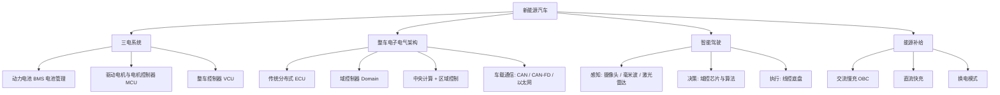

新能源汽车（New Energy Vehicle，NEV）指以非常规车用燃料为动力源、综合车辆动力控制和驱动方面的先进技术形成的汽车，主要包含**纯电动（BEV）、插电混动（PHEV）、增程式（EREV）和燃料电池（FCEV）**四类。它是「汽车 + 电子 + 软件」深度融合的典型，也是嵌入式与汽车电子工程师的核心赛道。

> [!info] 一句话定位
> 新能源汽车 = 三电系统（电池、电机、电控）+ 智能座舱 + 智能驾驶，本质是一台「带四个轮子的大电脑」。

## 知识体系

## 核心要点

- **三电系统**：电池、电机、电控是新能源车的技术核心，直接决定续航、动力和安全。
- **BMS（电池管理系统）**：实时监控电芯电压、温度、SOC（荷电状态），负责均衡与安全保护，是 [[MCU]] 的典型应用。
- **VCU（整车控制器）**：整车的大脑，协调动力、能量与故障处理，常运行 [[RTOS]] 或 [[AUTOSAR]] 软件。
- **电子电气架构演进**：从「上百个分布式 ECU」走向「域集中」再到「中央计算 + 区域控制」，直接推动 [[AUTOSAR]] 自适应平台（AP）的普及。
- **车载通信**：CAN / CAN-FD 仍是骨干，车载以太网承载大数据量传输（摄像头、雷达）。
- **智能驾驶**：感知—决策—执行三段式，是高算力芯片与 AI 算法的角力场。

## 与嵌入式的结合点

- 电控软件常基于 [[AUTOSAR]] 标准开发；
- 域控制器与 BMS 内部大量使用 [[STM32]]、[[MCU]] 与 [[RTOS]]；
- 车载网络知识离不开 [[计算机网络]]；
- 感知算法背后是 [[人工智能]]。

## 相关

- [[AUTOSAR]]
- [[MCU]]
- [[STM32]]
- [[工业互联网]]
