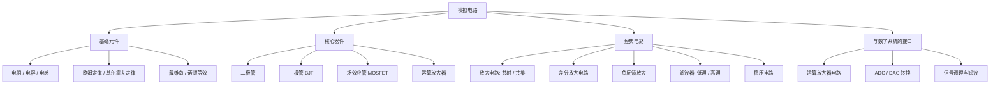

模拟电路处理的是**连续变化的电压和电流信号**。它是数字电路的「上游」：现实世界的温度、声音、光照都是模拟量，必须先经传感器和模拟前端变成电信号，再经 ADC 数字化后交给数字系统。可以说，**没有模拟电路，数字世界就没有入口**。

> [!info] 一句话定位
> 数字电路管「0 和 1」，模拟电路管「0 和 1 之间的所有值」。

## 知识体系

## 核心要点

- **两大基本定律**：基尔霍夫电流定律（KCL）与电压定律（KVL）是分析一切电路的基础。
- **半导体器件**：二极管单向导电；三极管和 MOSFET 是放大与开关的核心。
- **三极管放大**：通过把管子工作点偏置在放大区，让微小的基极电流控制较大的集电极电流。
- **运放电路**：理想运放「虚断、虚短」是分析同相/反相放大器、加法器、积分器的两大法宝。
- **负反馈**：牺牲增益换取稳定性、带宽和线性度，是实用放大器的必备手段。
- **接口意义**：模拟前端采集信号 → 运放调理 → ADC 采样，是 [[51单片机]]、[[STM32]] 采集物理量的标准链路。

## 学习建议

- 先理解**元器件特性曲线**，再学电路分析方法，最后落到典型电路。
- 动手仿真（Multisim / LTspice）+ 面包板实测，效果远好于纯理论。

## 相关

- [[数字电路]]
- [[电子基础]]
- [[51单片机]]
- [[常用芯片手册]]
