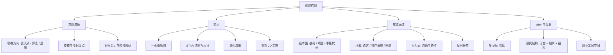

求职招聘是「把自身能力与岗位需求做匹配」的过程。对技术岗而言，核心就三件事：**简历能不能过关、笔试面试能不能打、谈薪能不能拿到合理价格**。这不是玄学，而是一套可以准备的方法。

> [!info] 一句话定位
> 求职 = 把自己当成产品，用简历做营销、用面试做交付、用复盘做迭代。

## 知识体系

## 核心要点

- **简历**：一页纸，突出「做了什么 + 结果如何（量化）」，用 STAR（情境-任务-行动-结果）描述项目。
- **定制化**：针对岗位 JD 调整关键词，让 HR 和机器筛选都能命中。
- **技术面三板斧**：语言基础、项目深度、现场手撕代码，三者都要练。
- **项目深挖**：面试官最爱问「为什么这么设计」「遇到什么坑」「如果重来怎么改」——提前准备好。
- **行为面**：用具体事例证明沟通、协作、抗压能力，别背空话。
- **反问环节**：问团队、问成长、问业务，展示你的认真，也帮你判断这家公司。
- **谈薪**：了解市场价（看 [[行业报告]]），多 offer 对比，关注总包而非只盯月薪。

## 常见坑

- 简历堆技术名词但无项目支撑；
- 只背八股、不会讲自己的项目；
- 海投不匹配的岗位，浪费精力。

## 相关

- [[程序员修养]]
- [[行业报告]]
- [[C语言]]
- [[数据结构与算法]]
