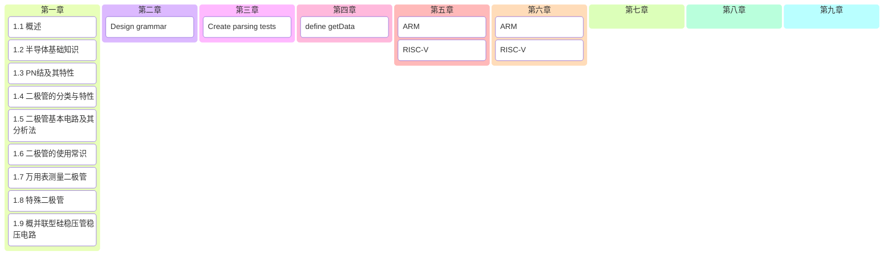

> [!NOTE]
> 链接地址：[电子基础](https://mooc1-1.chaoxing.com/mooc-ans/course/241034614.html)

* 学习[[EE]]

```mermaid
kanban
  [第一章]
    [1.1 概述]
    [1.2 半导体基础知识]
    [1.3 PN结及其特性]
    [1.4 二极管的分类与特性]
    [1.5 二极管基本电路及其分析法]
    [1.6 二极管的使用常识]
    [1.7 万用表测量二极管]
    [1.8 特殊二极管]
    [1.9 概并联型硅稳压管稳压电路]
  [第二章]
    [Design grammar]
  [第三章]
    [Create parsing tests]
  [第四章]
    [define getData] 
  [第五章]
    [ARM]
    [RISC-V]
  [第六章]
    [ARM]
    [RISC-V]
  [第七章]
  [第八章]
  [第九章]
```