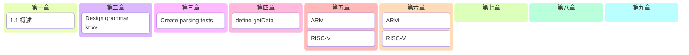

---

---
title: EE
---

学习[[EE]]

```mermaid
kanban
  [第一章]
    [1.1 概述]
  [第二章]
    [Design grammar]@{ ticket: 'knsv' }
  [第三章]
    [Create parsing tests]
  [第四章]
    [define getData] 
  [第五章]
    [ARM]
    [RISC-V]
  [第六章]
    [ARM]
    [RISC-V]
  [第七章]
  [第八章]
  [第九章]
```