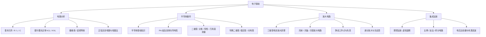

电子基础是电子类专业的入门课，核心内容包括**电路分析**与**模拟电子技术**两大块：先学会用基尔霍夫定律、等效变换等工具分析电路，再理解二极管、三极管、运放等半导体器件如何工作。

> [!info] 一句话定位
> 电子基础 = 电路分析（怎么算电压电流）+ 半导体器件（二极管、三极管、运放怎么用）。

> [!note] 课程来源
> 链接地址：[电子基础（超星慕课）](https://mooc1-1.chaoxing.com/mooc-ans/course/241034614.html)

## 知识体系

## 核心要点

- **电路分析工具**：KCL/KVL 是万用定律；**戴维南等效**把复杂网络化简为「一个电压源 + 一个电阻」，是解题利器。
- **PN 结**：半导体器件的物理核心，它的单向导电性解释了二极管的一切行为。
- **二极管应用**：整流、限幅、续流、稳压（稳压二极管）；判断好坏可用万用表二极管档。
- **三极管**：小电流控大电流，工作区分为截止、放大、饱和，放大电路的关键是**设置合适的静态工作点**。
- **集成运放**：现代模拟电路的主角，掌握「虚短、虚断」几乎能秒解所有运放电路。
- **通往数字世界**：运放电路 + [[数字电路]] 中的 ADC，构成模拟信号进入计算机的入口。

## 学习路径

电路分析 → 二极管 → 三极管 → 放大电路 → 运放 → 电源与稳压电路。

## 相关

- [[模拟电路]]
- [[数字电路]]
- [[EE]]
- [[51单片机]]
