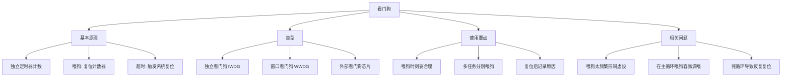

看门狗（Watchdog Timer，WDT）是嵌入式系统里最经典的**可靠性自保机制**：一个独立运行的定时器，程序必须定期「喂狗」（复位计数器），否则定时器溢出时就把系统**强制复位**。它的目标是让跑飞、死锁的嵌入式设备自动恢复，而不是一直卡死。

> [!info] 一句话定位
> 看门狗 = 一个「你不按时喂我，我就重启你」的定时器，是嵌入式系统的安全气囊。

## 知识体系

## 核心要点

- **原理**：看门狗内部有一个向下计数的定时器，只要在溢出前「喂狗」就清零重来；一旦程序跑飞没来得及喂，计数器溢出就触发复位。
- **独立看门狗（IWDG）**：用**独立时钟源**（如 STM32 的 LSI），即使主时钟挂了它也能工作，是最可靠的兜底。
- **窗口看门狗（WWDG）**：不仅要求「别太晚喂」，还要求「别太早喂」——喂狗必须在时间窗口内，能捕捉到程序跑得太快的异常。
- **外部看门狗芯片**：如 TPS3813、MAX6369，独立于 MCU 之外，可靠性更高，用于安全等级高的场合。
- **正确用法**：
  - 喂狗时间要**略大于最坏情况下一个完整循环的耗时**；
  - 推荐在**多个关键任务都正常执行**时才喂狗，避免「只要主循环活着就算健康」；
  - 在 STM32 上常用 [[RTOS]] 的空闲任务或独立任务喂狗。
- **常见坑**：把喂狗放在主循环里，一旦某段代码死循环但主循环没退出，看门狗反而被喂活了——这是设计缺陷。
- **复位溯源**：读 [[STM32]] 的 RCC_CSR 寄存器判断是否看门狗复位，便于现场诊断。

## 相关

- [[STM32]]
- [[RTOS]]
- [[MCU]]
- [[51单片机]]
