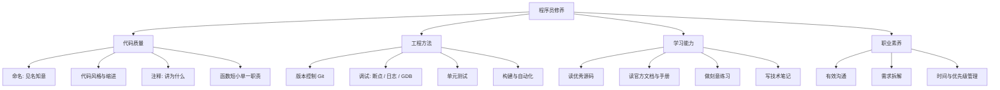

「程序员修养」指的是**写代码之外、但决定你职业高度**的那些能力：代码风格、调试方法、版本管理、阅读源码、以及持续学习的习惯。语法决定你能不能写出程序，修养决定你的程序能不能被别人接手、能不能活得久。

> [!info] 一句话定位
> 修养 = 让别人（和三个月后的自己）愿意读、看得懂、改得动的能力。

## 知识体系

## 核心要点

- **命名是最便宜的文档**：变量名 `timeoutMs` 远胜 `t`；函数名用动词，类型名用名词。
- **注释解释「为什么」，代码解释「是什么」**：别写 `i++; // i 加一`。
- **Debug 能力 > 编码能力**：先复现、再定位、后修复；善用断点、`printf`、日志和版本对比。
- **会用 Git**：提交信息清晰、小步提交、善用分支，是所有协作的前提。
- **读源码**：从一个小而精的项目开始（如某开源库），带着问题读，比漫无目的地看有效得多。
- **文档即能力**：能把一个问题讲清楚，说明你真的懂了。
- **持续学习**：技术半衰期很短，建立自己的知识库（比如这座 [[数字花园]]）比追热点更重要。

## 推荐习惯

1. 每天写一点笔记；2. 每个 Bug 都记录根因；3. 代码写完先自己 review 一遍；4. 保持英文技术阅读。

## 相关

- [[工具]]
- [[设计模式]]
- [[面对对象]]
- [[测试]]
