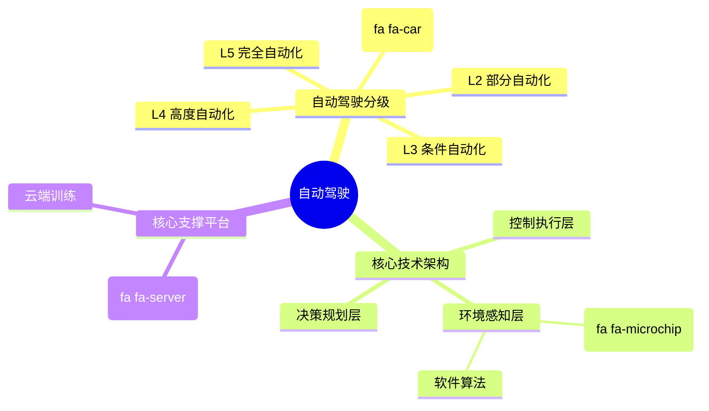

自动驾驶（Autonomous Driving）是指车辆通过车载传感器与算法自主完成环境感知、路径规划与行驶控制的驾驶方式。它利用摄像头、激光雷达（LiDAR）、毫米波雷达、超声波雷达及 GPS 等设备感测周围环境，并交由人工智能和计算机视觉模型进行极短时间内的推理与决策，最终转化为转向、加速与制动等车辆控制动作。 [1, 2, 3]
目前，国际汽车工程师学会（SAE）将自动驾驶技术统划分为 L0 至 L5 共六个等级： [4, 5]

## 自动驾驶分级与特征

| 级别 | 名称       | 核心特征                                                              | 驾驶主体         | 典型代表 / 场景                                                                                                                                 |
| ---- | ---------- | --------------------------------------------------------------------- | ---------------- | ----------------------------------------------------------------------------------------------------------------------------------------------- |
| L0   | 无自动化   | 纯人工驾驶，仅提供碰撞预警或盲区监测。                                | 人类驾驶员       | 传统无智驾汽车                                                                                                                                  |
| L1   | 驾驶辅助   | 车辆能单项控制转向或加减速（如自适应巡航）。                          | 人类驾驶员       | 单项 ACC 或 LKA 功能                                                                                                                            |
| L2   | 部分自动化 | 车辆同时控制转向和加减速，人类必须全程监管并随时接管。                | 人类与系统协同   | Tesla FSD、各类量产车的高阶辅助驾驶                                                                       |
| L3   | 条件自动化 | 特定路况下（如拥堵高架）由系统驾驶，人类在系统提示时才接管。          | 系统（人类后备） | 搭载特定交通拥堵引导系统的车型                                                                                                                  |
| L4   | 高度自动化 | 限定区域/场景下（如特定城市或无人的士）完全由系统控制，无须人类接管。 | 自动驾驶系统     | Waymo、萝卜快跑、小马智行 Robotaxi |
| L5   | 完全自动化 | 全场景、全天候的无条件完全自动驾驶，车内甚至无须设计方向盘与踏板。    | 自动驾驶系统     | 终极形态（暂未商用）                                                                                                                            |

## 行业现状与发展趋势

-
- 主动安全技术全面标配：自动避让系统（如 eAES）正从高端选装演变为“安全标配”。随着消费者刚需与政策的双轮驱动，主动安全技术在日常行驶中避免了大量潜在碰撞。 [6]
- Robotaxi（无人驾驶出租车）全球化布局：L4 级全自动驾驶已在全球多地开启商业化落地与出海进程。例如，Waymo 在北美已完成数千万次全天候行程，国内的萝卜快跑在多城扩大试运营，小马智行等企业也将商业化车队开进克罗地亚、伦敦及阿联酋等海外市场。 [1, 7, 8]
- 大算力平台与云端仿真：随着算法从传统规则向端到端大模型演进，智能汽车的落地高度依赖超强车载计算平台（如 [NVIDIA DRIVE AGX](https://www.nvidia.cn/solutions/autonomous-vehicles/) 系列）与云端 Omniverse 仿真验证系统的支持。 [9]
- 法规与社会议题：虽然技术突飞猛进，但全球各地的法规限制、责任划分以及对传统网约车/出租车司机群体的职业替代冲击，仍是技术全面普及前需要跨越的社会和法律门槛。 [1, 10]

> 链接： 

* [1] [https://zh.wikipedia.org](https://zh.wikipedia.org/zh-cn/%E8%87%AA%E5%8B%95%E9%A7%95%E9%A7%9B%E6%B1%BD%E8%BB%8A)
* [2] [https://aws.amazon.com](https://aws.amazon.com/cn/what-is/autonomous-driving/)
* [3] [https://www.tdk.cn](https://www.tdk.cn/zh/tech-mag/knowledgebox/002)
* [4] [https://www.synopsys.com](https://www.synopsys.com/zh-cn/automotive/autonomous-driving-levels.html)
* [5] [https://www.redhat.com](https://www.redhat.com/zh-cn/topics/edge-computing/what-is-an-autonomous-vehicle)
* [6] [https://auto.sina.cn](https://auto.sina.cn/2026-10-09/detail-iniuqywm6997519.d.html?vt=4)
* [7] [https://waymo.com](https://waymo.com/intl/zh-cn/)
* [8] [https://tj.chinadaily.com.cn](https://tj.chinadaily.com.cn/a/202610/08/WS6ac766a8e4b09a165c78e4d7.html)
* [9] [https://www.nvidia.cn](https://www.nvidia.cn/solutions/autonomous-vehicles/)
* [10] [https://www.zaobao.com.sg](https://www.zaobao.com.sg/news/singapore/story20261008-9803272)
  
---

* [[自动驾驶学习]]
