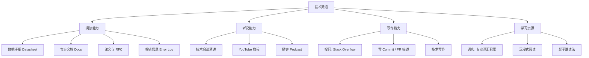

在 IT 与电子行业，**英语不是一门考试科目，而是一把钥匙**：官方文档、数据手册、开源社区、顶级论文几乎都是英文。技术英语的核心不是文学阅读，而是「快速获取准确信息」的能力。

> [!info] 一句话定位
> 技术英语 = 读得懂 Datasheet 和官方文档 + 说得清自己的问题。

## 知识体系

## 核心要点

- **优先读原文**：中文翻译往往滞后且失真，能读英文手册是嵌入式工程师的硬要求。
- **攻克高频术语**：datasheet、register、peripheral、interrupt、timeout……这些词在手册里高频重复，认熟一批就能顺畅阅读。
- **善用报错信息**：程序报错大多是英文，读懂关键字（undefined、segmentation fault、overflow）能大幅提升调试效率。
- **提问要会问**：用英文把「环境 + 现象 + 已尝试 + 期望结果」讲清楚，是获取社区帮助的前提。
- **输出倒逼输入**：尝试用英文写技术笔记或提交信息，进步最快。
- **长期主义**：每天 15 分钟原文阅读，坚持半年胜过突击背单词。

## 学习建议

先读**自己专业领域**的英文材料（如 [[STM32]] 的 Reference Manual），有背景知识支撑，理解难度会低很多。

## 相关

- [[程序员修养]]
- [[常用芯片手册]]
- [[行业报告]]
