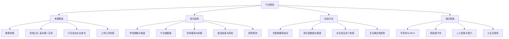

行业报告是把**行业现状、市场规模、竞争格局与未来趋势**系统化呈现的信息产品。对工程师而言，读报告不是为了追热点，而是为了回答三个问题：**这个行业在往哪走？我需要补什么技能？机会在哪里？**

> [!info] 一句话定位
> 行业报告 = 用数据和图表回答「行业现在怎么样、未来会怎样」。

## 知识体系

## 核心要点

- **来源分级**：券商研报数据全但立场偏「看好」；咨询公司方法论强；协会白皮书权威但更新慢；**财报最真实**。
- **看报告的姿势**：先读摘要与结论 → 再看关键图表 → 最后才抠细节，切忌逐字读。
- **抓住四要素**：市场规模、增速、产业链、竞争格局。
- **识别噪音**：警惕「预设立场」和「数据来源不明」的结论，多来源交叉验证。
- **落到自己**：工程师读报告，最终要转化为**技能规划**——比如看到「域控制器」趋势，就该补 [[AUTOSAR]]。

## 关注的赛道

- **半导体 / MCU**：国产替代、车规芯片。
- **新能源汽车**：见 [[新能源汽车]]，三电与智能驾驶。
- **AI 与算力**：见 [[人工智能]]，大模型与边缘算力。
- **工业互联网**：见 [[工业互联网]]，OT 与 IT 融合。

## 相关

- [[新能源汽车]]
- [[人工智能]]
- [[工业互联网]]
- [[求职招聘]]
