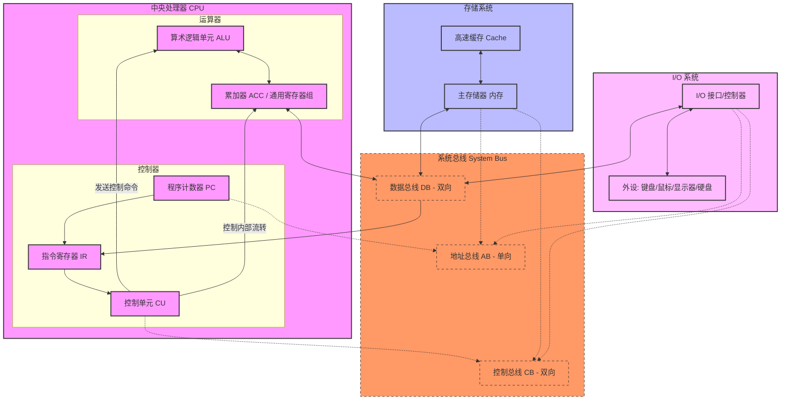

计算机组成原理（Computer Organization）是计算机专业极其核心的底层硬件基础课程。它主要研究计算机系统内部各个硬件部件的组成结构、工作原理以及如何协同执行程序。
该课程通常承接自《数字电路与逻辑设计》，并为《操作系统》 和《编译原理》 打下硬件全局观。以下是国内高校（如清华、哈工大、华科等）及考研（408科目）普遍通用的详细学习内容大纲：

---

### 1. 计算机系统概述
这一章主要建立对计算机的整体宏观认知。

  
* 冯·诺依曼架构：核心思想（“存储程序”原理、五大硬件部件：运算器、控制器、存储器、输入设备、输出设备）。
* 现代计算机结构：以 CPU/内存 为中心的结构模型。
* 计算机系统层次结构：硬件、微程序、机器语言、汇编语言、高级语言的层层抽象。
* 性能指标评估：吞吐量、响应时间、时钟周期（CPU Clock Cycle）、主频、CPI（每条指令时钟周期数）、MIPS、FLOPS。
  

### 2. 数据的表示与运算

计算机底层如何存储并计算数字和文本。

  
* 数制与编码：二进制、八进制、十六进制转换；BCD码、ASCII码、字符编码。
* 定点数的表示：原码、反码、补码（重点，解决减法变加法）、移码。
* 浮点数的表示：IEEE 754 浮点数标准（阶码、尾数、符号位、单精度/双精度）。
* 定点数运算：移位操作（算术移位/逻辑移位）、加减法溢出判断、乘法运算（Booth算法）、除法运算。
* 算术逻辑单元 (ALU)：串行进位与并行进位加法器（CLA）、ALU 的结构与逻辑电路。
  

### 3. 存储器层次结构
解决 CPU 的高速与硬盘/内存的低速之间的矛盾（金字塔存储模型）。

  
* 存储器分类：RAM（SRAM 快但贵，DRAM 慢但便宜、需定期刷新）、ROM 的种类。
* 主存储器（内存）：内存条的内部结构、地址译码驱动、内存芯片的位扩展与字扩展。
* 高速缓存 (Cache)：
* 工作原理：局部性原理（时间/空间局部性）。
   * 地址映射：直接映射、全相联映射、组相联映射。
   * 替换算法：LRU（最近最少使用）、FIFO、随机法。
   * 写策略：写回法（Write-back）、全写法（Write-through）。
* 虚拟存储器：页式、段式、段页式虚拟存储；TLB（快表） 与 Page Table（慢表）的查询流程（与操作系统高度重合）。
 

### 4. 指令系统 (ISA)
软件与硬件交互的接口协议，即 CPU 能听懂的指令集。

  
* 指令格式：操作码（OP）+ 地址码（A）；定长操作码与扩展操作码。
* 寻址方式：立即寻址、直接寻址、间接寻址、寄存器寻址、基址寻址、变址寻址、相对寻址等。
* CISC 与 RISC：复杂指令集（如 x86）与精简指令集（如 ARM、MIPS、RISC-V）的深度对比。
  

### 5. 中央处理器 (CPU)
计算机的“大脑”，也是全书难度最高的硬核部分。

  
* CPU 内部结构：运算器（ALU、暂存器）、控制器（PC、IR、CU）、通用寄存器组。
* 指令周期与数据通路：一条指令从“取指（IF） -> 译码（ID） -> 执行（EX） -> 访存（MEM） -> 写回（WB）”在硬件电路中的完整流转路径。
* 控制器实现设计：硬布线控制器（纯硬件组合逻辑电路）与微程序控制器（微指令、微程序）。
* 指令流水线 (Pipeline)：
* 基本概念：流水线并行机制。
   * 流水线冒险（冲突）：结构冒险（硬件资源冲突）、数据冒险（RAW/WAR/WAW，通过数据旁路、暂停、空指令解决）、控制冒险（分支预测失败）。
  

### 6. 总线系统 (Bus)
硬件部件之间传输信息的公共通道。

  
* 分类：片内总线、系统总线（数据、地址、控制总线）、通信总线。
* 总线仲裁：当多个设备抢总线时由谁决定（集中式：链式查询、计数器定时查询、独立请求；分布式）。
* 总线定时（传输同步）：同步定时、异步定时（握手协议）。
* 常见标准：PCI、PCIe、USB 等基本概念。
  

### 7. 输入/输出 (I/O) 系统
CPU 如何与显卡、键盘、硬盘等外设进行通信。

 
* I/O 接口（控制器）：I/O 端口的编址方式（统一编址 VS 独立编址）。
* I/O 控制方式（由浅入深）：
   1. 程序查询方式：CPU 死等外设，效率极低。
   2. 程序中断方式：外设准备好了“拍拍”CPU，引入中断处理流程、中断向量表、中断屏蔽字。
   3. DMA 方式（直接内存存取）：外设和内存直接传数据，传完再通知 CPU，不占用 CPU 资源。
  

------------------------------
### 💡 核心学习建议与经典教材

   1. 避开纯死记硬背：这门课的灵魂在于“连线”。你需要亲自动手画一画“单周期/多周期 CPU 的数据通路图”，理清一条 add 指令或者 lw (加载) 指令在电路里是怎么跑的，这样逻辑就会瞬间清晰。
   2. 经典教材推荐：
      * 国内主流：唐朔飞的《计算机组成原理》、袁春风的《计算机系统基础》（非常推崇自顶向下的系统观）。
      * 国际公认圣经：《Computer Organization and Design》（俗称 COD，作者为图灵奖得主 Patterson 和 Hennessy），通常基于 MIPS 或 RISC-V 架构，深入浅出。
      * 考研/实战复习：《王道计算机组成原理》（其总结的动画与题目对理清概念极有帮助）。
   

