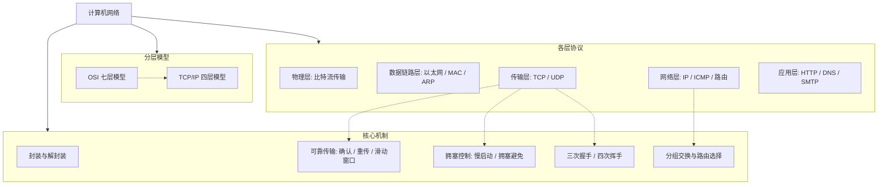

计算机网络研究的是「如何把地理上分散的计算机连接起来，可靠、高效地交换数据」。它的核心思想只有一个：**分层（Layering）**——把复杂的通信问题拆成若干层，每层只解决自己的问题，并为上层提供服务。

> [!info] 一句话定位
> 计算机网络 = 分层模型 + 每层的协议。学它的关键在于理解「数据从应用层一路封装到物理层，再在对端一层层解封装」的全过程。

## 知识体系

## 分层对照

| 层次 | OSI 七层 | TCP/IP 四层 | 典型协议 |
| --- | --- | --- | --- |
| 上 | 应用层 / 表示层 / 会话层 | 应用层 | HTTP、HTTPS、DNS、SMTP |
| 中 | 传输层 | 传输层 | TCP、UDP |
| 中 | 网络层 | 网络层 | IP、ICMP、ARP、路由协议 |
| 下 | 数据链路层 | 网络接口层 | 以太网、MAC、PPP |
| 下 | 物理层 | 网络接口层 | 双绞线、光纤、无线 |

## 核心要点

- **物理层**：解决 0/1 比特如何在介质上传输（电压、光、电磁波），关注带宽、时延、编码。
- **数据链路层**：把比特流组织成「帧」，负责差错检测与 MAC 寻址，典型是**以太网**。
- **网络层**：解决「跨网络寻址与路由」，核心是 **IP 协议**；IP 只尽力而为，不保证送达。
- **传输层**：
  - **TCP**：面向连接、可靠、有序，靠三次握手建连、确认重传、流量控制和拥塞控制。
  - **UDP**：无连接、不可靠、开销小，适合实时音视频和高频小包。
- **应用层**：直接面向用户业务，HTTP 是 Web 的基础，DNS 负责域名解析。

## TCP vs UDP

| 维度 | TCP | UDP |
| --- | --- | --- |
| 连接 | 面向连接 | 无连接 |
| 可靠性 | 可靠、有序 | 不可靠、可能乱序 |
| 开销 | 头 20 字节起 | 头仅 8 字节 |
| 场景 | 文件传输、网页、邮件 | 直播、游戏、DNS 查询 |

## 相关

- [[数据结构与算法]]
- [[操作系统]]
- [[计算机组成原理]]
- 参考教材：《计算机网络——自顶向下方法》
