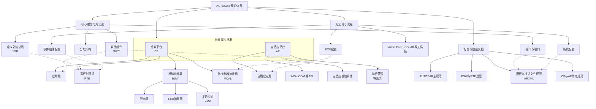
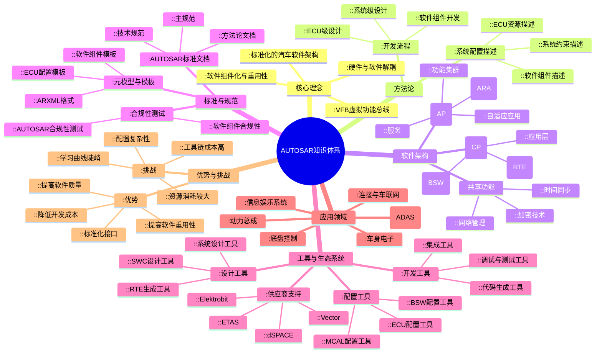

## AUTOSAR的知识体系

```mermaid

flowchart TD
    A[AUTOSAR 知识体系]

    A --> B[核心理念与方法论]
    A --> C[软件架构标准]
    A --> D[方法论与流程]
    A --> E[标准与规范文档]

    B --> B1[分层架构]
    B --> B2[虚拟功能总线<br>VFB]
    B --> B3[软件组件<br>SWC]
    B --> B4[接口与端口]

    subgraph C [软件架构标准]
        direction LR
        C1[经典平台<br>CP]
        C2[自适应平台<br>AP]
    end

    C1 --> C1A[应用层]
    C1 --> C1B[运行时环境<br>RTE]
    C1 --> C1C[基础软件层<br>BSW]
    C1 --> C1D[微控制器抽象层<br>MCAL]

    C1C --> C1C1[服务层]
    C1C --> C1C2[ECU抽象层]
    C1C --> C1C3[复杂驱动<br>CDD]

    C2 --> C2A[自适应应用]
    C2 --> C2B[ARA::COM 等API]
    C2 --> C2C[自适应基础软件]
    C2 --> C2D[执行管理<br>等服务]

    D --> D1[系统配置]
    D --> D2[ECU配置]
    D --> D3[软件组件配置]
    D --> D4[Arctic Core, ISOLAR等工具链]

    E --> E1[AUTOSAR主规范]
    E --> E2[BSW与RTE规范]
    E --> E3[模板与描述文件规范<br>ARXML]
    E --> E4[CP与AP特定规范]

    %% 关键连接关系
    B2 -.-> C1B
    B3 -.-> C1A
    B3 -.-> C2A
    B4 -.-> E3
    D1 -.-> E3
    D2 -.-> C1D
    D3 -.-> C1B


```
## 思维导图

```mermaid
mindmap
  root((AUTOSAR知识体系))
    
    核心理念
      :标准化的汽车软件架构
      :硬件与软件解耦
      :软件组件化与重用性
      :VFB虚拟功能总线
    
    方法论
      :系统配置描述
        ::软件组件描述
        ::ECU资源描述
        ::系统约束描述
      :开发流程
        ::系统级设计
        ::ECU级设计
        ::软件组件开发
    
    软件架构
      经典平台(CP)
        ::应用层
          :::软件组件(SWC)
          :::原子软件组件
          :::组合软件组件
        ::运行时环境(RTE)
          :::SWC间通信
          :::SWC与BSW通信
        ::基础软件层(BSW)
          :::服务层
            ::::操作系统(OS)
            ::::通信服务(COM)
            ::::内存管理(NVM)
            ::::诊断服务(DEM/DCM)
          :::ECU抽象层
            ::::通信硬件抽象
            ::::内存硬件抽象
            ::::I/O硬件抽象
          :::微控制器抽象层(MCAL)
            ::::驱动程序
            ::::ADC, CAN, PWM等
          :::复杂设备驱动(CDD)
      自适应平台(AP)
        ::自适应应用
        ::自适应AUTOSAR运行时(ARA)
          :::通信管理(ARA::COM)
          :::持久化(ARA::Persistence)
          :::诊断(ARA::DM)
        ::功能集群
          :::执行管理
          :::状态管理
          :::更新与配置管理
        ::服务
      共享功能
        ::加密技术
        ::网络管理
        ::时间同步
    
    标准与规范
      :AUTOSAR标准文档
        ::主规范
        ::技术规范
        ::方法论文档
      :元模型与模板
        ::ARXML格式
        ::软件组件模板
        ::ECU配置模板
      :合规性测试
        ::AUTOSAR合规性测试
        ::软件组件合规性
    
    工具与生态系统
      :设计工具
        ::系统设计工具
        ::SWC设计工具
        ::RTE生成工具
      :配置工具
        ::ECU配置工具
        ::BSW配置工具
        ::MCAL配置工具
      :开发工具
        ::代码生成工具
        ::调试与测试工具
        ::集成工具
      :供应商支持
        ::Vector
        ::ETAS
        ::Elektrobit
        ::dSPACE
    
    应用领域
      :车身电子
      :底盘控制
      :动力总成
      :高级驾驶辅助系统(ADAS)
      :信息娱乐系统
      :连接与车联网
    
    优势与挑战
      :优势
        ::提高软件重用性
        ::降低开发成本
        ::提高软件质量
        ::标准化接口
      :挑战
        ::学习曲线陡峭
        ::工具链成本高
        ::配置复杂性
        ::资源消耗较大

```