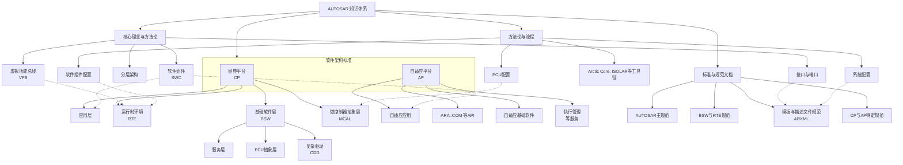

## AUTOSAR的知识体系

```mermaid

flowchart TD
    A[AUTOSAR 知识体系]

    A --> B[核心理念与方法论]
    A --> C[软件架构标准]
    A --> D[方法论与流程]
    A --> E[标准与规范文档]

    B --> B1[分层架构]
    B --> B2[虚拟功能总线<br>VFB]
    B --> B3[软件组件<br>SWC]
    B --> B4[接口与端口]

    subgraph C [软件架构标准]
        direction LR
        C1[经典平台<br>CP]
        C2[自适应平台<br>AP]
    end

    C1 --> C1A[应用层]
    C1 --> C1B[运行时环境<br>RTE]
    C1 --> C1C[基础软件层<br>BSW]
    C1 --> C1D[微控制器抽象层<br>MCAL]

    C1C --> C1C1[服务层]
    C1C --> C1C2[ECU抽象层]
    C1C --> C1C3[复杂驱动<br>CDD]

    C2 --> C2A[自适应应用]
    C2 --> C2B[ARA::COM 等API]
    C2 --> C2C[自适应基础软件]
    C2 --> C2D[执行管理<br>等服务]

    D --> D1[系统配置]
    D --> D2[ECU配置]
    D --> D3[软件组件配置]
    D --> D4[Arctic Core, ISOLAR等工具链]

    E --> E1[AUTOSAR主规范]
    E --> E2[BSW与RTE规范]
    E --> E3[模板与描述文件规范<br>ARXML]
    E --> E4[CP与AP特定规范]

    %% 关键连接关系
    B2 -.-> C1B
    B3 -.-> C1A
    B3 -.-> C2A
    B4 -.-> E3
    D1 -.-> E3
    D2 -.-> C1D
    D3 -.-> C1B


```