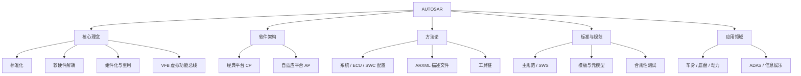

AUTOSAR（AUTomotive Open System ARchitecture，汽车开放系统架构）是由全球主要汽车厂商、零部件供应商与半导体公司联合制定的**汽车电子软件架构标准**。它的目标是让汽车软件标准化、可复用、可跨平台移植，是当今智能汽车软件开发的行业基石。

> [!info] 一句话定位
> AUTOSAR = 汽车软件的「操作系统级标准」：定义分层架构、组件模型、通信机制与开发流程，让不同厂商的软件能像积木一样拼装。

## 知识体系

## 子页面导航

- [[核心理念]] —— 标准化、软硬件解耦、组件化、VFB 虚拟功能总线
- [[软件架构]] —— 经典平台 CP 与自适应平台 AP 的分层设计
- [[方法论]] —— 系统配置、ECU 配置、SWC 配置与 ARXML 开发流程
- [[标准与规范]] —— 主规范、SWS、模板规范与合规性测试
- [[应用领域]] —— 车身、底盘、动力、ADAS、信息娱乐与车联网
- [[规范模块]] —— 规范模块库总索引：CP / AP / FO 三平台与 27 个核心模块笔记

## 为什么值得学

- 汽车电子是目前嵌入式领域**最稳定、需求最大**的赛道之一；
- AUTOSAR 是主流车企与 Tier1 的通用语言，掌握它等于拿到入场券；
- 它把「实时控制（CP）」与「高算力智能（AP）」两种范式统一在一套标准下，技术视野宽阔。

## 相关

- [[新能源汽车]]
- [[RTOS]]
- [[MCU]]
- [[软件架构]]
- [[规范模块]]
