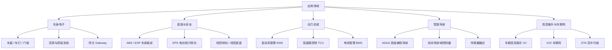

AUTOSAR 几乎覆盖了现代汽车的所有电子控制领域：从车身、底盘、动力总成，到高级驾驶辅助、信息娱乐与车联网。不同领域对实时性、算力与安全等级的要求不同，因而分别落在**经典平台（CP）**与**自适应平台（AP）**上。

> [!info] 一句话定位
> 只要车上有一个 ECU 要跑标准化软件，就大概率在用 AUTOSAR。

## 知识体系

## 各领域要点

- **车身电子（Body）**：最典型的 CP 应用，实时性要求不高但节点多，常用 CAN / LIN，AUTOSAR 的价值在于统一管理与低成本复用。
- **底盘与安全（Chassis & Safety）**：涉及 ABS、ESP、EPS 等，对**实时性与功能安全（ISO 26262）**要求极高，是 CP 的核心战场。
- **动力总成（Powertrain）**：发动机、变速箱、电池管理，控制周期短、精度要求高，长期是 AUTOSAR CP 的重镇。
- **智能驾驶（ADAS / AD）**：算力密集，需要处理摄像头、雷达、激光雷达的海量数据，是 **AP** 的主要应用场景；常与 [[人工智能]] 算法结合。
- **信息娱乐与车联网（IVI & V2X）**：面向服务、需要频繁 OTA 更新，AP 的面向服务通信（SOME/IP）与动态部署能力非常契合。

## CP 与 AP 的落地分布

| 领域 | 主要平台 | 关键诉求 |
| --- | --- | --- |
| 车身 | CP | 低成本、多节点 |
| 底盘 / 动力 | CP | 实时性、功能安全 |
| 智能驾驶 | AP（+ CP 混合） | 高算力、可扩展 |
| 信息娱乐 / 车联网 | AP | 面向服务、可 OTA |

## 相关

- [[AUTOSAR]]
- [[软件架构]]
- [[新能源汽车]]
- [[人工智能]]
- [[规范模块]]
- [[CP]] ｜ [[AP]]
