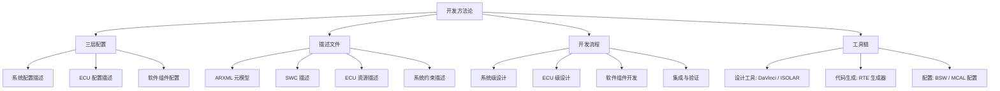

AUTOSAR 不只是「一套代码架构」，更是一整套**开发方法论（Methodology）**：用统一的描述文件（ARXML）串起「系统设计 → ECU 设计 → 软件组件开发 → 集成验证」的全流程，让不同团队、不同供应商的工作能无缝对接。

> [!info] 一句话定位
> 方法论 = 用 ARXML 描述文件 + 配置工具链，把「设计」自动生成「代码」的标准化流程。

## 知识体系

## 三层配置

- **系统配置（System Configuration）**：定义整车级别的软件组件、它们的连接关系、以及运行在哪些 ECU 上，产出系统描述文件。
- **ECU 配置（ECU Configuration）**：针对单个 ECU，配置 BSW（OS、COM、NVM、诊断等）与 MCAL 驱动，产出 ECU 配置参数。
- **软件组件配置（SWC Configuration）**：描述 SWC 的端口、接口、数据类型与内部行为。

## 开发流程

1. **系统级设计**：用工具（如 DaVinci Developer / ISOLAR）搭建整车软件组件拓扑，定义 VFB 上的通信关系。
2. **ECU 级设计**：把系统映射到具体 ECU，配置 BSW 与 MCAL。
3. **软件组件开发**：基于生成的 RTE 接口编写应用逻辑，SWC 只需实现 runnable（可运行实体）。
4. **RTE 生成**：工具根据配置自动生成 RTE 代码，把虚拟连接变成真实的函数调用与通信。
5. **集成与验证**：编译、烧录、在台架与实车上验证功能与实时性。

## ARXML 与元模型

- **ARXML** 是基于 XML 的 AUTOSAR 描述文件格式，是各工具之间交换信息的「通用语言」。
- 它由 **AUTOSAR 元模型（Meta-Model）** 约束，保证不同厂商工具生成的文件能互相理解。
- 一份完整的工程，往往包含成千上万个 ARXML 文件，靠工具管理而非手工维护。

## 工具链

| 环节 | 代表工具 | 厂商 |
| --- | --- | --- |
| 设计与配置 | DaVinci | Vector |
| 设计与配置 | ISOLAR | ETAS |
| 设计与配置 | EB tresos | Elektrobit |
| 代码生成与集成 | 各家 RTE 生成器 | 随工具链 |

## 相关

- [[AUTOSAR]]
- [[核心理念]]
- [[软件架构]]
- [[标准与规范]]
- [[SystemTemplate]] ｜ [[ECUConfiguration]]
- [[规范模块]]
