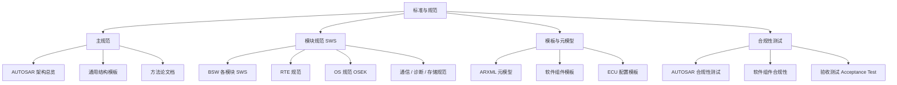

AUTOSAR 的「标准」并不只是一份文档，而是一整套**规范体系（Specifications）**：主规范定义总体架构，各类 SWS（Software Specification）定义每个模块的接口与行为，模板规范定义 ARXML 的格式，合规性测试保证各家实现真正互通。

> [!info] 一句话定位
> AUTOSAR 规范 = 「架构总纲 + 每个模块的接口说明书 + 描述文件模板 + 合规性测试」，共同保证跨厂商互操作。

## 知识体系

## 规范分类

- **主规范（Main / General Specifications）**：定义 AUTOSAR 的总体分层架构、术语、通用机制与方法论，是所有其它规范的根。
- **软件规范（SWS，Software Specification）**：针对每个 BSW 模块（如 COM、NVM、DEM、OS）与 RTE，规定其功能、API、配置参数与行为，是**写代码和做配置的直接依据**。
- **模板规范（Template Specifications）**：定义 ARXML 描述文件的格式与元模型，保证不同工具之间的文件能互相解析。
- **CP / AP 特定规范**：经典平台与自适应平台各自专属的规范集合。
- **AUTOSAR OS 规范**：基于 OSEK/VDX 扩展，规定了任务、调度、中断等实时行为。

## 合规性测试

- **AUTOSAR 合规性测试（Conformance Test）**：验证一个 BSW 实现是否符合规范，是供应商产品「贴 AUTOSAR 标签」的前提。
- **软件组件合规性**：验证 SWC 是否满足接口与行为约束，保证能集成进不同工程。
- **验收测试（Acceptance Test）**：面向应用层的功能验证。

## 怎么用这些规范

1. 先读**主规范**建立整体认知；
2. 做具体模块时查对应的 **SWS**；
3. 处理描述文件时对照**模板规范**；
4. 选型或集成时关注对方的**合规性测试报告**。

## 相关

- [[AUTOSAR]]
- [[核心理念]]
- [[软件架构]]
- [[方法论]]
- [[规范模块]]
- [[CP]] ｜ [[AP]] ｜ [[FO]]
