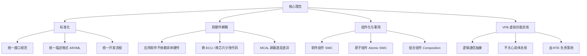

AUTOSAR（AUTomotive Open System ARchitecture）的核心理念，是用**标准化的软件架构**把汽车电子软件从「一车一版、重复造轮子」变成「组件化、可复用、可跨平台移植」。它由全球主流车企、零部件商与半导体厂商联合制定，是当今汽车电子的行业基石。

> [!info] 一句话定位
> AUTOSAR 的初心：让汽车软件像搭积木一样——**标准化接口、软硬件解耦、组件复用**。

## 知识体系

## 四大理念详解

- **标准化（Standardization）**：接口、描述文件、开发流程全部统一，不同供应商的软件才能拼到一起。
- **软硬件解耦（Hardware-Software Decoupling）**：应用层软件只面向逻辑接口编程，底层换芯片、换 ECU 时尽量不动应用代码，由 MCAL 与 ECU 抽象层屏蔽差异。
- **组件化与重用（Componentization & Reuse）**：把功能拆成独立可复用的**软件组件（SWC）**，一次开发、多项目复用，降低成本与缺陷率。
- **VFB（Virtual Function Bus，虚拟功能总线）**：一个逻辑通信抽象层，SWC 之间只通过「端口」收发数据，**不关心数据实际走 CAN、LIN 还是以太网**；运行阶段由 RTE 把这些虚拟连接映射到真实通信。

## 带来的价值

| 维度 | 传统开发 | AUTOSAR |
| --- | --- | --- |
| 软件复用 | 差，重复开发 | 好，组件跨项目复用 |
| 硬件迁移 | 改动大 | 改动小，主要调 MCAL |
| 供应商协作 | 接口各自为政 | 统一规范，便于集成 |
| 质量与成本 | 难保证 | 标准化提升质量、降成本 |

## 代价与挑战

- 学习曲线陡峭，概念与工具链门槛高；
- 资源占用较大，对 MCU 性能与内存要求高；
- 配置复杂，ARXML 与工具链成本不低。

## 相关

- [[AUTOSAR]]
- [[软件架构]]
- [[方法论]]
- [[标准与规范]]
- [[规范模块]]
