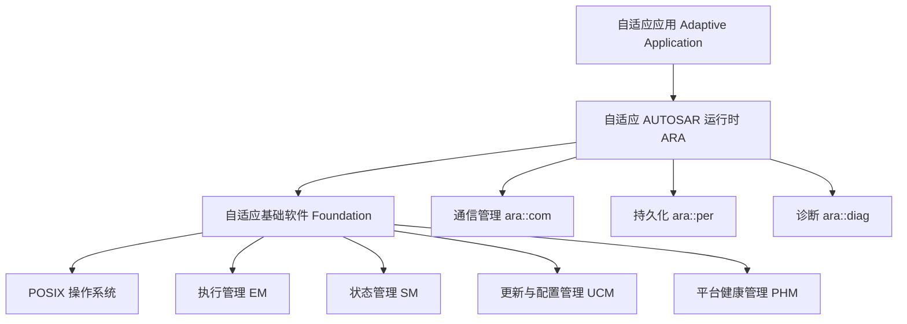

**自适应平台（Adaptive Platform，AP）** 是 AUTOSAR 面向**高性能计算**（域控制器 / 中央计算单元）的平台，基于 POSIX 操作系统（如 Linux）、用 C++ 开发，采用**面向服务（SOA）**的通信（SOME/IP、以太网），支持应用的**动态部署与 OTA 更新**。它是智能驾驶、智能座舱等算力密集场景的底座。

> [!info] 一句话定位
> AP = 为「高算力、可动态部署、面向服务」的智能汽车软件打造的标准化运行时。

## 架构视图

## 类别统计

| 类别 | 数量 | 说明 |
| --- | --- | --- |
| EXP | 13 | 解释性指南（Explanation） |
| SWS | 25 | 软件模块规范（功能簇） |
| RS | 14 | 需求规范 |
| TR | 6 | 技术报告 |
| TPS | 3 | 模板规范 |
| MOD | 3 | 元模型 |
| SRC | 1 | 源码头文件 |

## 核心模块

### 入门与架构

- [[PlatformDesign]] —— AP 平台设计总览（**AP 入门首选**）
- [[SWArchitecture]] —— AP 软件架构视图（架构模型）
- [[ARAComAPI]] —— ara::com API 详解（面向服务通信入门）

### 运行时与基础

- [[CommunicationManagement]] —— 通信管理（ara::com 规范）
- [[Core]] —— ara::core 基础库与公共数据类型
- [[ExecutionManagement]] —— 执行管理 EM（进程启停）
- [[StateManagement]] —— 状态管理 SM（功能组状态机）

### 其他功能簇（速查）

| 功能簇 | 主题 | 类别 |
| --- | --- | --- |
| Persistency | ara::per 持久化 | SWS |
| Diagnostics | ara::diag 诊断 | SWS |
| Cryptography | 加密 | SWS |
| UpdateAndConfigurationManagement | OTA 更新 | SWS |
| PlatformHealthManagement | 平台健康监控 | SWS |
| TimeSynchronization | 时间同步 | SWS |
| NetworkManagement | 网络管理 | SWS |
| IntrusionDetectionSystemManager | 入侵检测（IDSM） | SWS |
| Firewall | 防火墙 | SWS |
| LogAndTrace | 日志与追踪 | SWS |

## 相关

- [[AUTOSAR]]
- [[软件架构]]
- [[标准与规范]]
- [[CP]] ｜ [[FO]]
- [[规范模块]]
- [[人工智能]]
