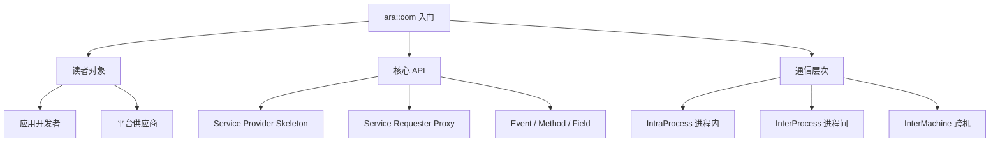

**ARAComAPI** 是 AP 通信管理 API（`ara::com`）的**入门解释文档**。因为直接读正式规范不易理解，本文档专为两类读者做入口：**AP 应用开发者**（用 ara::com 与其它应用 / 服务交互）与 **AP 平台供应商**（为 ara::com 实现优化的 IPC 绑定的实现者）。

> [!info] 一句话定位
> 学 `ara::com` 之前**必读**的引导文档：先懂设计意图与行为，再看 SWS 的形式化细节。

## 规范信息

| 项目 | 内容 |
| --- | --- |
| 平台 | AP |
| 类别 | EXP — 解释性指南（Explanation） |
| UID | 846 |
| 版本 | R25-11 |
| 本地 PDF | [AUTOSAR_AP_EXP_ARAComAPI.pdf](file:///F:/Work/Standards/01_Sources/AP_EXP_ARAComAPI_846/AUTOSAR_AP_EXP_ARAComAPI.pdf) |
| 纯文本全文 | [AP_EXP_ARAComAPI.complete.txt](file:///F:/Work/Standards/01_Sources/AP_EXP_ARAComAPI_846/zzgen/AP_EXP_ARAComAPI.complete.txt) |

## 知识体系

## 核心要点

- **为什么需要它**：正式规范不好读，本文档作为学习 `ara::com` 的入口，建议在深入相关 SWS 之前先读本文。
- **核心概念**：`ara::com` 是 AP 通信管理功能簇的 C++ 命名空间；面向服务的通信通过**服务提供者骨架（Skeleton）**与**服务请求者代理（Proxy）**实现，通信要素包括**事件（Event）、方法（Method）、字段（Field）**。
- **通信层次**：覆盖进程内（IntraProcess）、进程间（InterProcess）、跨机（InterMachine）各层级。
- **平台供应商视角**：为 ara::com 实现优化的 **IPC 绑定**是该文档面向的第二类读者。

## 依赖关系

- 是 [[CommunicationManagement]]（ara::com 需求规范）的**前置导读**；构成 AP 面向服务通信的基础。

## 相关

- [[CommunicationManagement]]
- [[PlatformDesign]]
- [[SOMEIPTransformer]]
- [[AP]]
- [[规范模块]]
