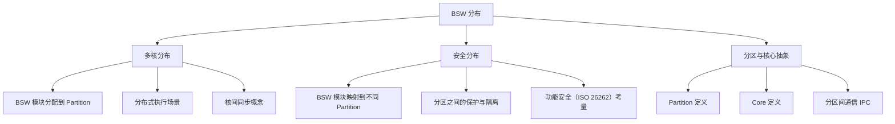

`BSWDistributionGuide` 是 CP 解释性指南（EXP），讲清一个核心问题：**基础软件（BSW）如何分布到多核 CPU 的不同分区（Partition）上**，以及在功能安全场景下如何做分区隔离与内存保护。它分两部分：多核分布与安全分布。

> [!info] 一句话定位
> 学 CP 的**第一站**：先理解「BSW 怎么摆到多核 / 分区分核」，后面所有模块的部署都以它为背景。

## 规范信息

| 项目 | 内容 |
| --- | --- |
| 平台 | CP |
| 类别 | EXP — 解释性指南（Explanation） |
| UID | 631 |
| 版本 | R25-11 |
| 本地 PDF | [AUTOSAR_CP_EXP_BSWDistributionGuide.pdf](file:///F:/Work/Standards/01_Sources/CP_EXP_BSWDistributionGuide_631/AUTOSAR_CP_EXP_BSWDistributionGuide.pdf) |
| 纯文本全文 | [CP_EXP_BSWDistributionGuide.complete.txt](file:///F:/Work/Standards/01_Sources/CP_EXP_BSWDistributionGuide_631/zzgen/CP_EXP_BSWDistributionGuide.complete.txt) |

## 知识体系

## 核心要点

- **为什么分布**：把 BSW 模块分配到不同分区 / 核心，可同时提升**功能安全**（隔离故障域）与**性能**（并行执行）。自 R4.1 起支持在**多核系统**上分配 BSW 到分区；自 R4.2 起支持在**安全场景**下把 BSW 映射到不同分区并相互保护。
- **支持的场景**：文档给出多种「BSW 在多个分区与核心上分布式执行」的场景，以及能提升性能的典型用例。
- **同步与通信**：引入适用于分布式 BSW 执行的基础同步概念，以及**分区间通信（Inter-Partition Communication）**的入门。
- **上层依赖**：分区的定义依赖虚拟模块 `EcuC`，OS 与 RTE 通过 **IOC** 跨分区传数据。

## 依赖关系

- 与 [[OS]]（OS-Application / 分区保护）、[[RTE]]（IOC 跨分区通信）、`EcuC`（分区与核心定义）紧密相关。
- 是理解 [[ECUStateManager]] 多核 STARTUP/SHUTDOWN 协调的背景知识。

## 相关

- [[ModeManagementGuide]]
- [[RTE]]
- [[OS]]
- [[CP]]
- [[规范模块]]
