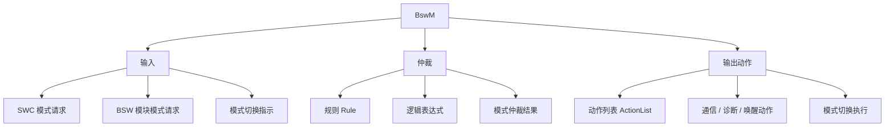

**BswM（BSW Mode Manager，BSW 模式管理）** 是 CP 基础软件模块，实现**整车模式管理（Vehicle Mode Management）**与**应用模式管理（Application Mode Management）**中位于 BSW 的那一部分：它按简单规则**仲裁**来自应用层 SWC 或其它 BSW 模块的模式请求，并依据仲裁结果**执行动作**。

> [!info] 一句话定位
> 模式管理的「规则引擎」：把各方模式请求按规则裁决，再触发一串配置好的动作。

## 规范信息

| 项目 | 内容 |
| --- | --- |
| 平台 | CP |
| 类别 | SWS — 软件模块规范（Software Specification） |
| UID | 313 |
| 版本 | R25-11 |
| 本地 PDF | [AUTOSAR_CP_SWS_BSWModeManager.pdf](file:///F:/Work/Standards/01_Sources/CP_SWS_BSWModeManager_313/AUTOSAR_CP_SWS_BSWModeManager.pdf) |
| 纯文本全文 | [CP_SWS_BSWModeManager.complete.txt](file:///F:/Work/Standards/01_Sources/CP_SWS_BSWModeManager_313/zzgen/CP_SWS_BSWModeManager.complete.txt) |

## 知识体系

## 核心要点

- **职责**：仲裁应用层 SWC 或其它 BSW 模块的模式请求，并执行相应动作——是 CP 模式管理的**中枢**。
- **规则 + 动作**：BswM 高度可配置，核心配置对象是**规则（Rule）**（评估条件）与**动作列表（ActionList）**（依据结果执行的动作）。
- **接口广泛但多数可选**：BswM 与众多 BSW 模块都有接口，但绝大多数是**可选**的，按具体 ECU 需求启用；规范中列出的依赖只是可能交互的概览，并非穷举。
- **常见缩写**：BSW、BswM、BSWMD、CDD、Dem、Det、ECU。

## 依赖关系

- 与 [[ECUStateManager]]（EcuM 仲裁 RUN/POST_RUN 并通知 BswM）、[[COMManager]]（请求通信模式）、[[DiagnosticEventManager]]（Dem）、[[RTE]] 等交互；配置方法见 [[ModeManagementGuide]]。

## 相关

- [[ModeManagementGuide]]
- [[ECUStateManager]]
- [[COMManager]]
- [[CP]]
- [[规范模块]]
