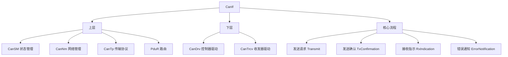

**CanIf（CAN Interface，CAN 接口）** 位于 CAN 设备驱动（CanDrv、CanTrcv）与上层通信服务（CanSM、CanNm、CanTp、PduR）之间，为上层提供**统一的 CAN 硬件抽象**：屏蔽不同 CAN 控制器 / 收发器的差异，用「物理 CAN 通道」的视角统一管理。

> [!info] 一句话定位
> CAN 通信栈的「中间层」：向下管控制器、向上报事件与转数据。

## 规范信息

| 项目 | 内容 |
| --- | --- |
| 平台 | CP |
| 类别 | SWS — 软件模块规范（Software Specification） |
| UID | 012 |
| 版本 | R25-11 |
| 本地 PDF | [AUTOSAR_CP_SWS_CANInterface.pdf](file:///F:/Work/Standards/01_Sources/CP_SWS_CANInterface_012/AUTOSAR_CP_SWS_CANInterface.pdf) |
| 纯文本全文 | [CP_SWS_CANInterface.complete.txt](file:///F:/Work/Standards/01_Sources/CP_SWS_CANInterface_012/zzgen/CP_SWS_CANInterface.complete.txt) |

## 知识体系

## 核心要点

- **定位**：夹在 CAN 底层驱动与上层通信服务之间，是上层访问 CanDrv 服务的接口。
- **硬件无关**：把所有 CAN 硬件无关的任务集中实现在 CanIf，使底层驱动只需专注具体硬件的访问与控制；多个内部 / 外部控制器与收发器可由 CanSM 以「物理通道」视角统一管控。
- **数据流**：发送时，CanIf 补全参数并把 CAN L-PDU 经 CanDrv 交给控制器；接收时，把收到的 L-PDU 作为 **L-SDU** 分发给上层。**接收 L-SDU 与上层模块的对应关系是静态配置的**。
- **控制流**：转发 CanSM 向下的状态变更请求；向上转发来自 CanDrv / CanTrcv 的事件。
- **接口视角**：数据处理与通知 API 基于 CAN L-SDU；控制与模式处理 API 基于 CAN 控制器。

## 依赖关系

- 被 [[PDURouter]]（经 CanIf 收发 PDU）、[[COM]] 链路依赖；与 CanDrv、CanTrcv、CanSM、CanNm、CanTp 协作。

## 相关

- [[PDURouter]]
- [[COM]]
- [[COMManager]]
- [[CP]]
- [[规范模块]]
