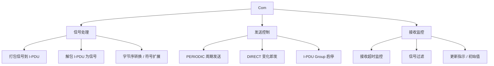

**Com（Communication，通信）** 是 CP 基础软件模块，位于其使用者（RTE、SwCluC）与 [[PDURouter]] 之间，提供**面向信号（Signal）**的数据接口：把信号打包成 I-PDU 发送、把收到的 I-PDU 解包成信号，并控制发送行为。

> [!info] 一句话定位
> 「信号 ↔ 报文」的翻译官：管打包 / 解包与发送模式，是通信栈里最贴近应用语义的一层。

## 规范信息

| 项目 | 内容 |
| --- | --- |
| 平台 | CP |
| 类别 | SWS — 软件模块规范（Software Specification） |
| UID | 015 |
| 版本 | R25-11 |
| 本地 PDF | [AUTOSAR_CP_SWS_COM.pdf](file:///F:/Work/Standards/01_Sources/CP_SWS_COM_015/AUTOSAR_CP_SWS_COM.pdf) |
| 纯文本全文 | [CP_SWS_COM.complete.txt](file:///F:/Work/Standards/01_Sources/CP_SWS_COM_015/zzgen/CP_SWS_COM.complete.txt) |

## 知识体系

## 核心要点

- **主功能**：面向信号的收发接口；把 AUTOSAR 信号打包进待发送的 I-PDU、把收到的 I-PDU 解包；**信号 / 信号组网关**路由（把接收 I-PDU 的信号转入发送 I-PDU）。
- **发送控制**：I-PDU Group 的启停、发送请求复制、保证发送 I-PDU 之间的蕞小间隔、每个 I-PDU 支持两种发送模式。
- **接收处理**：接收信号超时监控、入站信号过滤、多种通知机制、初始值与更新指示、字节序转换、符号扩展。
- **大数据支持**：支持大长度与动态长度数据类型。

## 依赖关系

- 位于 [[RTE]] / SwCluC 与 [[PDURouter]] 之间；由 [[COMManager]]（ComM）通过 I-PDU Group 使能通信。

## 相关

- [[PDURouter]]
- [[CANInterface]]
- [[COMManager]]
- [[RTE]]
- [[CP]]
- [[规范模块]]
