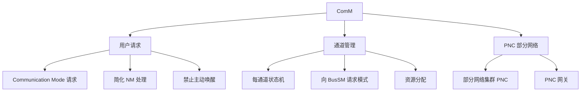

**ComM（Communication Manager，通信管理器）** 是 CP 基础软件中的**资源管理器**，封装对底层通信服务的控制。它面向「通信请求者（User）」而不是具体 SWC / Runnable，收集并协调整条总线的通信访问请求。

> [!info] 一句话定位
> 「能不能用总线」的总开关：用户只说想要「通信模式」，ComM 负责把对应通道的通信能力开 / 关。

## 规范信息

| 项目 | 内容 |
| --- | --- |
| 平台 | CP |
| 类别 | SWS — 软件模块规范（Software Specification） |
| UID | 079 |
| 版本 | R25-11 |
| 本地 PDF | [AUTOSAR_CP_SWS_COMManager.pdf](file:///F:/Work/Standards/01_Sources/CP_SWS_COMManager_079/AUTOSAR_CP_SWS_COMManager.pdf) |
| 纯文本全文 | [CP_SWS_COMManager.complete.txt](file:///F:/Work/Standards/01_Sources/CP_SWS_COMManager_079/zzgen/CP_SWS_COMManager.complete.txt) |

## 知识体系

## 核心要点

- **目的**：
  - 简化用户对总线通信栈的使用（含简化的网络管理处理）；
  - 协调同一 ECU 上多个独立 SWC 对总线通信栈（收发信号）的可用性；
  - 提供禁用发送的 API，防止 ECU 主动唤醒总线（CAN 上每条报文都会唤醒总线，FlexRay 需专门的唤醒模式）；
  - 为每个通道实现通道状态机，从而管理 ECU 的多个总线通道；
  - 允许把持续唤醒总线的 ECU 强制置入「无通信」模式；
  - 通过分配所需资源简化资源管理（如防止通信期间 ECU 关断）。
- **用户无需懂硬件**：用户只需请求「通信模式」，ComM 就把对应通道的通信能力开 / 关；实际总线状态由对应的 Bus State Manager 控制。
- **PNC 扩展**：支持跨网络的「部分网络集群（Partial Network Cluster）」，`PNC 网关` 可跨层次化的物理总线 / 网络。

## 依赖关系

- 向 BusSM（如 CanSM、FrSM）请求通信模式；与 [[BSWModeManager]]、[[ECUStateManager]]、[[COM]] 协作。

## 相关

- [[COM]]
- [[PDURouter]]
- [[BSWModeManager]]
- [[ECUStateManager]]
- [[CP]]
- [[规范模块]]
