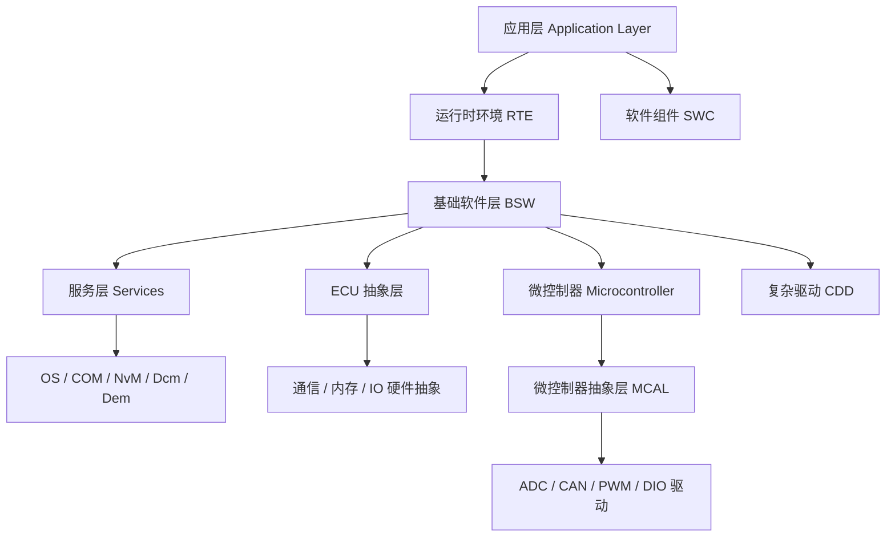

**经典平台（Classic Platform，CP）** 是 AUTOSAR 面向**实时控制 ECU** 的平台，基于静态配置的运行时环境（RTE）与 AUTOSAR OS（OSEK 血统），用 C 语言开发，通信以 CAN / LIN / FlexRay 为主。它是车身、底盘、动力总成等 ECU 的主流选择。

> [!info] 一句话定位
> CP = 为「硬实时、资源受限」的经典 ECU 打造的标准化软件栈。

## 分层架构

## 类别统计

| 类别 | 数量 | 说明 |
| --- | --- | --- |
| EXP | 22 | 解释性指南（Explanation），理解概念的首选 |
| SWS | 115 | 软件模块规范，写代码 / 做配置的直接依据 |
| RS | 43 | 需求规范（Requirements Specification） |
| TPS | 7 | 模板规范，定义 ARXML 格式 |
| TR | 12 | 技术报告（Technical Report） |
| MOD | 5 | 元模型（Model） |

## 核心模块

### 概念与架构

- [[BSWDistributionGuide]] —— BSW 分布与多核部署指南（EXP）
- [[ModeManagementGuide]] —— 模式管理与 BswM 配置示例（EXP）
- [[RTE]] —— 运行时环境，VFB 的落地实现（SWS）

### 系统服务

- [[OS]] —— 操作系统，基于 OSEK/VDX（SWS）
- [[ECUStateManager]] —— ECU 状态管理 EcuM（SWS）
- [[BSWModeManager]] —— BSW 模式管理 BswM（SWS）

### 通信栈

- [[COMManager]] —— 通信管理器 ComM（资源管理）
- [[COM]] —— COM 信号打包 / 解包与发送控制
- [[PDURouter]] —— PDU 路由器（通信栈枢纽）
- [[CANInterface]] —— CAN 接口（硬件抽象）
- [[TcpIp]] —— TCP/IP 协议栈（以太网）
- [[SOMEIPTransformer]] —— SOME/IP 序列化转换器

### 诊断与存储

- [[DiagnosticCommunicationManager]] —— Dcm，UDS 诊断通信
- [[DiagnosticEventManager]] —— Dem，故障事件与 DTC 存储
- [[NVRAMManager]] —— NvM，非易失数据管理

### 安全

- [[E2ELibrary]] —— 端到端通信保护库（ASIL D）
- [[CryptoServiceManager]] —— 加密服务管理器 CSM

### 模板与配置

- [[SystemTemplate]] —— 系统描述模板（整车视角）
- [[SoftwareComponentTemplate]] —— 软件组件模板（SWC 建模）
- [[ECUConfiguration]] —— ECU 配置参数定义

## 相关

- [[AUTOSAR]]
- [[软件架构]]
- [[标准与规范]]
- [[AP]] ｜ [[FO]]
- [[规范模块]]
